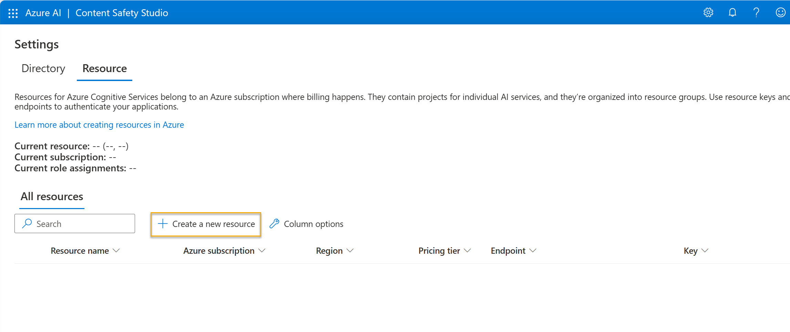

---
lab:
  title: Explorar os serviços de IA do Azure
---

> **Importante**
> **O laboratório Detector de Anomalias foi preterido e substituído pela atualização abaixo.**

Os serviços de IA do Azure ajudam os usuários a criar aplicativos de IA com APIs e modelos prontos para uso, predefinidos e personalizáveis. Neste exercício, você examinará um dos serviços, a Segurança de Conteúdo de IA do Azure, no Content Safety Studio. 

O Content Safety Studio permite explorar como o conteúdo de texto e imagem pode ser moderado. Execute testes em textos ou imagens de exemplo e obtenha uma pontuação de severidade que varia de seguro a alto para cada categoria. Neste exercício de laboratório, você criará um recurso de serviço único no Content Safety Studio e testará suas funcionalidades. 

> **Observação** A meta deste exercício é obter uma noção geral de como os serviços de IA do Azure são provisionados e usados. A Segurança de Conteúdo é usada como exemplo, mas não se espera que você obtenha um conhecimento abrangente da segurança de conteúdo neste exercício!

## Navegar pelo Content Safety Studio 

1. Abra o [Content Safety Studio](https://contentsafety.cognitive.azure.com?azure-portal=true). Se você não estiver conectado, precisará entrar. Selecione **Entrar** no canto superior direito da tela. Use o email e a senha associados à sua assinatura do Azure para entrar. 

1. O Content Safety Studio é configurado como muitos outros estúdios para serviços de IA do Azure. No menu na parte superior da tela, clique no ícone à esquerda de *IA do Azure*. Você verá uma lista suspensa de outros estúdios projetados para desenvolvimento com serviços de IA do Azure. Você pode clicar no ícone novamente para ocultar a lista.

  

## Associar um recurso ao estúdio 

Antes de usar o estúdio, você precisa associar um recurso de serviços de IA do Azure ao estúdio. Dependendo do estúdio, você pode achar que precisa de um recurso de serviço único específico ou pode usar um recurso geral de vários serviços. No caso do Content Safety Studio, você pode usar o serviço criando um recurso de *Segurança de conteúdo* de serviço único ou um recurso geral de vários serviços dos *serviços de IA do Azure*. Nas etapas abaixo, criaremos um recurso de Segurança de Conteúdo de serviço único. 

1. No canto superior direito da tela, clique no ícone **Configurações**. 

1. Na página **Configurações**, você verá uma guia *Diretório* e a guia *Recurso*. Na guia *Recurso*, selecione **Criar um novo recurso**. Isso leva você à página para criar um recurso no Portal do Azure.

> **Observação** A guia *Diretório* permite que os usuários selecionem diretórios diferentes para criar recursos. Você não precisa alterar suas configurações, a menos que deseje usar um diretório diferente. 

1. Na página *Criar segurança de conteúdo* no [portal do Azure](https://portal.azure.com?auzre-portal=true), você precisa configurar vários detalhes para criar seu recurso. Defina-o com as seguintes configurações:
    - **Assinatura**: *sua assinatura do Azure*.
    - **Grupo de recursos**: *selecione ou crie um grupo de recursos com um nome exclusivo*.
    - **Região**: *escolha uma região disponível*.
    - **Nome**: *insira um nome exclusivo*.
    - **Tipo de preço**: F0 gratuito

1. Selecione **Examinar + Criar** e examine a configuração. Em seguida, selecione **Criar**. A tela indicará quando a implantação for concluída. 

*Parabéns! Você acabou de criar ou provisionar um recurso dos serviços de IA do Azure. O que você provisionou em específico é um recurso de serviço de Segurança de conteúdo de serviço único.*

1. Quando a implantação for concluída, abra uma nova guia e retorne ao [Content Safety Studio](https://contentsafety.cognitive.azure.com?azure-portal=true). 

1. Clique no ícone **Configurações** no canto superior direito da tela Desta vez, você deverá ver que o recurso recém-criado foi adicionado à lista.  

1. Na página Configurações do Content Safety Studio, selecione o recurso do serviço de IA do Azure que você acabou de criar e clique em **Usar recurso** na parte inferior da tela. Você será levado de volta para a home page do estúdio. Agora você pode começar a usar o estúdio com o recurso recém-criado.

## Experimentar a moderação de texto no Content Safety Studio

1. Na página inicial do Content Safety Studio, em *Executar testes de moderação*, navegue até a caixa **Moderar conteúdo de texto** e clique em **Experimentar**.
1. Em Executar um teste simples, selecione **Conteúdo seguro**. Observe que o texto é exibido na caixa abaixo. 
1. Clique em **Executar teste**. Executar um teste chama o modelo de aprendizado profundo do serviço de Segurança de Conteúdo. O modelo de aprendizado profundo já foi treinado para reconhecer conteúdo não seguro.
1. No painel *Resultados*, inspecione os resultados. Há quatro níveis de gravidade, de seguro a alto, e quatro tipos de conteúdo prejudicial. O serviço de IA de Segurança de Conteúdo considera esse exemplo aceitável ou não? O que é importante observar é que os resultados estão dentro de um intervalo de confiança. Um modelo bem treinado, como um dos modelos prontos para uso da IA do Azure, pode retornar resultados que têm uma alta probabilidade de corresponder ao que um humano rotularia o resultado. Sempre que você executa um teste, você chama o modelo novamente. 
1. Agora, tente outra amostra. Selecione o texto em Conteúdo violento com erro de ortografia. Verifique se o conteúdo é exibido na caixa abaixo.
1. Selecione **Executar teste** e inspecione os resultados no painel Resultados novamente. 

Execute testes em todos os exemplos fornecidos e inspecione os resultados.

## Confira as chaves e o ponto de extremidade

Esses recursos testados podem ser programados em todos os tipos de aplicativos. As chaves e o ponto de extremidade usados para o desenvolvimento de aplicativos podem ser encontrados no Content Safety Studio e no portal do Azure. 

1. No Content Safety Studio, navegue de volta para a página **Configurações**, com a guia *Recursos* selecionada. Procure o recurso que você usou. Role para ver o ponto de extremidade e a chave do recurso. 
1. No Portal do Azure, você verá que eles são o *mesmo* ponto de extremidade e chaves *diferentes* para o recurso. Para verificar, vá para o [portal do Azure](https://portal.azure.com?auzre-portal=true). Pesquise *Segurança de conteúdo* na barra de pesquisa superior. Localize seu recurso e clique nele. No menu à esquerda, procure em *Gerenciamento de recursos* por *Chaves e pontos de extremidade*. Selecione **Chaves e pontos de extremidade** para exibir o ponto de extremidade e as chaves do recurso. 

Depois de terminar, você pode excluir o recurso de Segurança de Conteúdo do Portal do Azure. Excluir o recurso é uma maneira de reduzir os custos acumulados quando o recurso existe na assinatura. Para fazer isso, navegue até a página **Visão geral** do recurso Segurança de conteúdo. Selecione **Excluir** na parte superior da tela. 
