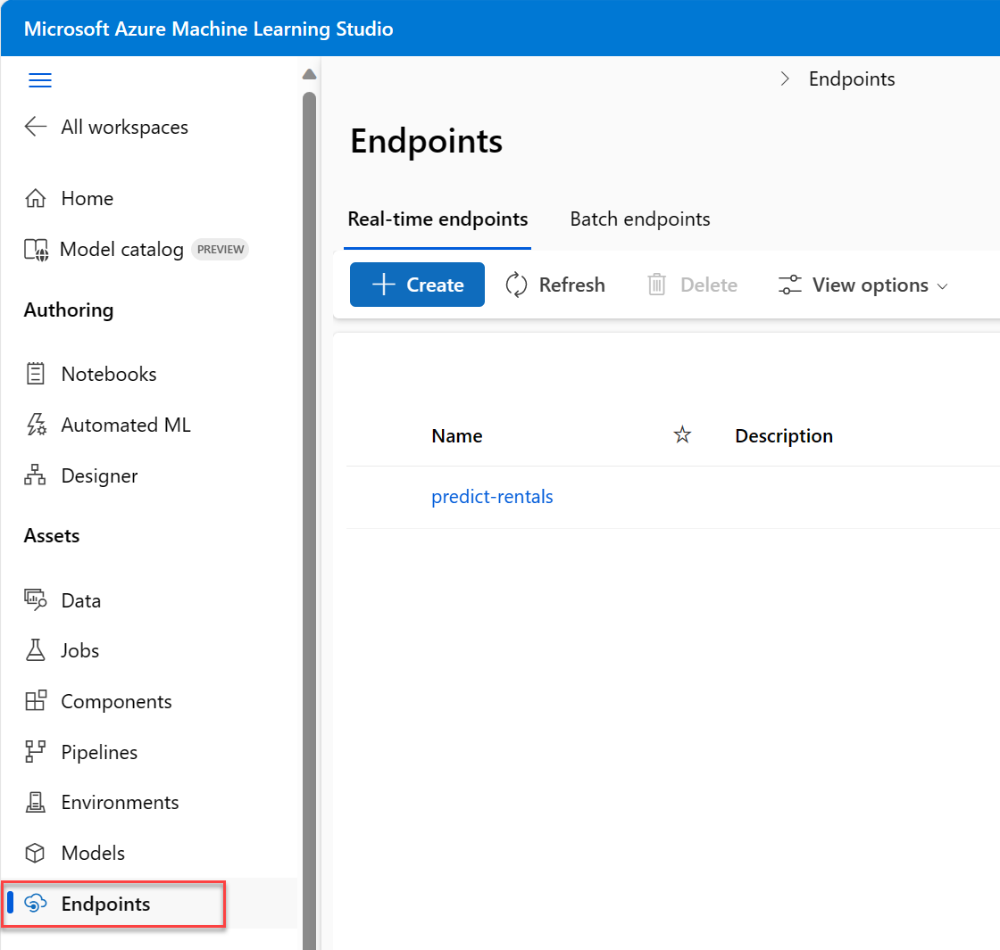

---
lab:
  title: Explorar o machine learning automatizado no Azure ML
---

# <a name="explore-automated-machine-learning-in-azure-ml"></a>Explorar o machine learning automatizado no Azure ML

> **Observação** Para concluir este laboratório, você precisará de uma [assinatura do Azure](https://azure.microsoft.com/free?azure-portal=true) na qual tenha acesso administrativo.

Nesse caso, você usará um conjunto de dados de detalhes históricos de aluguel de bicicleta para treinar um modelo que prevê o número de aluguéis de bicicletas que deve ser esperado em um determinado dia, com base em características sazonais e meteorológicas.

## <a name="create-an-azure-machine-learning-workspace"></a>Criar um workspace do Azure Machine Learning  

1. Entre no [portal do Azure](https://portal.azure.com?azure-portal=true) usando suas credenciais da Microsoft.

1. Selecione **+ Criar um recurso**, procure *Machine Learning* e crie um recurso do **Azure Machine Learning** com um plano do *Azure Machine Learning*. Use as configurações a seguir:
    - **Assinatura**: *sua assinatura do Azure*.
    - **Grupo de recursos**: *crie ou selecione um grupo de recursos*.
    - **Nome do workspace**: *insira um nome exclusivo para o workspace*.
    - **Região**: *selecione a região geográfica mais próxima*.
    - **Conta de armazenamento**: *anote a nova conta de armazenamento padrão que será criada para o workspace*.
    - **Cofre de chaves**: *anote o novo cofre de chaves padrão que será criado para o workspace*.
    - **Application Insights**: *anote o novo recurso Application Insights padrão que será criado para o workspace*.
    - **Registro de contêiner**: nenhum (*será criado um automaticamente quando você implantar um modelo em um contêiner pela primeira vez*).

1. Selecione **Examinar + criar**e **Criar**. Aguarde até que o workspace seja criado (isso pode demorar alguns minutos) e acesse o recurso implantado.

1. Selecione **Iniciar o estúdio** (ou abra uma nova guia do navegador, acesse [https://ml.azure.com](https://ml.azure.com?azure-portal=true) e entre no Estúdio do Azure Machine Learning usando a conta Microsoft).

1. Se a mensagem **Quais são as metas de machine learning hoje?** for exibida, selecione **Cancelar**.

1. Se a mensagem **Bem-vindo(a) ao Estúdio!** for exibida, selecione **X**.

1. No Estúdio do Azure Machine Learning, você verá o workspace recém-criado. Se esse não for o caso, clique em **Microsoft** no menu à esquerda. Depois, no novo menu à esquerda, selecione **Workspaces**, em que todos os workspaces associados à assinatura estão listados. Escolha o que você criou para este exercício. 

> **Observação** Este módulo é um dos vários que usam um workspace do Azure Machine Learning, incluindo os outros módulos do roteiro de aprendizagem [Conceitos básicos de IA do Microsoft Azure: explore ferramentas visuais para machine learning](https://docs.microsoft.com/learn/paths/create-no-code-predictive-models-azure-machine-learning/). Se você estiver usando sua assinatura do Azure, considere a possibilidade de criar o workspace uma vez e reutilizá-lo em outros módulos. Será cobrada uma pequena quantidade de armazenamento de dados em sua assinatura do Azure se o workspace do Azure Machine Learning existir na assinatura. Portanto, recomendamos que você exclua o workspace do Azure Machine Learning quando ele não for mais necessário.

## <a name="create-compute"></a>Criar computação

1. No [Estúdio do Azure Machine Learning](https://ml.azure.com?azure-portal=true), selecione as três linhas na parte superior esquerda para ver as várias páginas na interface (talvez seja necessário maximizar o tamanho da tela). Use essas páginas no painel esquerdo para gerenciar os recursos no workspace. Selecione a página **Computação** (em **Gerenciar**).

1. Na página **Computação**, selecione a guia **Clusters de cálculo** e adicione um novo cluster de cálculo com as configurações a seguir. Você o usará para treinar um modelo de machine learning:
    - **Localização**: *selecione a mesma que a do workspace. Se essa localização não estiver listada, escolha a mais próxima de você*.
    - **Camada da máquina virtual**: dedicada
    - **Tipo de máquina virtual**: CPU
    - **Tamanho da máquina virtual**:
        - Escolha **Selecionar entre todas as opções**
        - Pesquise e selecione **Standard_DS11_v2**
    - Selecione **Avançar**
    - **Nome da computação**: *insira um nome exclusivo*.
    - **Número mínimo de nós**: 0
    - **Número máximo de nós**: 2
    - **Segundos de espera antes de reduzir verticalmente**: 120
    - **Habilitar o acesso SSH**: desmarque
    - Escolha **Criar**

> **Observação** As instâncias de computação e os clusters de cálculo se baseiam em imagens de máquina virtual do Azure Standard. Para este módulo, a imagem *Standard_DS11_v2* é recomendada para atingir o equilíbrio ideal entre custo e desempenho. Se a sua assinatura tiver uma cota que não inclua essa imagem, escolha uma imagem alternativa. Mas tenha em mente que uma imagem maior pode gerar um custo maior e uma imagem menor pode não ser suficiente para concluir as tarefas. Como alternativa, peça ao administrador do Azure para estender sua cota.

O cluster de cálculo leva algum tempo para ser criado. Você pode ir para a próxima etapa enquanto aguarda.

## <a name="create-a-dataset"></a>Criar um conjunto de dados

1. Exiba os dados separados por vírgula em [https://aka.ms/bike-rentals](https://aka.ms/bike-rentals?azure-portal=true) no seu navegador da Web.

1. No [Estúdio do Azure Machine Learning](https://ml.azure.com?azure-portal=true), selecione as três linhas no canto superior esquerdo da tela para expandir o painel. Exiba a página **Dados** (em **Ativos**). A página de Dados contém arquivos ou tabelas de dados específicos com os quais você trabalhará no Azure ML. Você também pode criar conjuntos de dados nessa página.

1. Na página **Dados**, na guia **Ativos de dados**, selecione **Criar**. Depois, defina um ativo de dados com as seguintes configurações:
    * **Tipo de dados**:
        * **Nome**: bike-rentals
        * **Descrição**: dados de aluguel de bicicleta
        * **Tipo de conjunto de dados**: tabular
    * **Fonte de dados**: de arquivos da Web
    * **URL da Web**: 
        * **URL da Web**: [https://aka.ms/bike-rentals](https://aka.ms/bike-rentals?azure-portal=true)
        * **Ignorar validação de dados**: *não selecionar*
    * **Configurações**:
        * **Formato de arquivo**: delimitado
        * **Delimitador**: vírgula
        * **Codificação**: UTF-8
        * **Cabeçalhos de coluna**: somente o primeiro arquivo tem cabeçalhos
        * **Ignorar linhas**: Nenhum
        * **O conjunto de dados contém dados multilinhas**: *não selecione*
    * **Esquema**:
        * incluir todas as colunas que não sejam **Caminho**
        * Examinar os tipos detectados automaticamente
    * **Revisão**
        * Escolha **Criar**

1. Depois que o conjunto de dados tiver sido criado, abra-o e exiba a página **Explorar** para ver uma amostra dos dados. Esses dados contêm as características e os rótulos históricos para aluguéis de bicicletas.

> **Citação**: *esses dados são derivados de [Capital Bikeshare](https://www.capitalbikeshare.com/system-data) e são usados de acordo com [contrato de licença](https://www.capitalbikeshare.com/data-license-agreement) dos dados publicados*.

## <a name="run-an-automated-machine-learning-job"></a>Executar um trabalho de machine learning automatizado

Siga as próximas etapas para executar um trabalho que usa o machine learning automatizado para treinar um modelo de regressão que prevê aluguéis de bicicletas.

1. No [estúdio do Azure Machine Learning](https://ml.azure.com?azure-portal=true), veja a página **ML Automatizado** (em **Criar**).

1. Crie um trabalho de ML automatizado com as seguintes configurações:
    - **Selecione o ativo de dados**:
        - **Conjunto de dados**: bike-rentals
    - **Configure o trabalho**:
        - **Nome do novo experimento**: mslearn-bike-rental
        - **Coluna de destino**: rentals (*esse é o rótulo que o modelo será treinado para prever)*
        - **Selecione o cluster de cálculo do Azure ML**: *o cluster de cálculo que você já criou*.
    - **Selecione a tarefa e as configurações:** 
        - **Tipo de tarefa**: regressão *(o modelo prevê um valor numérico)* 

    

    Observe que, sob o tipo de tarefa, há as configurações *Exibir definições de configuração adicionais* e *Exibir configurações de definição de recursos*. Agora, defina essas configurações.

    - **Definições de configuração adicionais:**
        - **Métrica primária**: selecione **Raiz do erro quadrático médio normalizada**
        - **Explicar o melhor modelo**: selecionado – *essa opção faz com que o machine learning automatizado calcule a importância do recurso para o melhor modelo, o que possibilita determinar a influência de cada recurso no rótulo previsto.*
        - **Usar todos os modelos com suporte**: <u>Não</u>selecionado. *Você restringirá o trabalho para experimentar apenas alguns algoritmos específicos.*
        - **Modelos permitidos**: *selecione apenas **RandomForest** e **LightGBM**. O ideal seria tentar usar o máximo possível, mas cada modelo adicionado aumenta o tempo necessário para executar o trabalho.*

        
        - **Critério de saída**:
            - **Tempo do trabalho de treinamento (horas)** : 0,5 – *Encerra o trabalho após no máximo 30 minutos.*
            - **Limite de pontuação da métrica**: 0,085 – *Se um modelo atingir uma pontuação de métrica de raiz do erro quadrático médio normalizada de até 0,085, o trabalho será encerrado.*
        - **Simultaneidade**: *não alterar*
    - **Configurações de definição de recursos:**
        - **Habilitar definição de recursos**: selecionado – *pré-processar automaticamente os recursos antes do treinamento.*

    Clique em **Avançar** para ir ao próximo painel de seleção.

    - **Selecionar a validação e o tipo de teste**
        - **Tipo de validação**: Automático
        - **Ativo de dados de teste (versão prévia)** : nenhum ativo de dados de teste é necessário

1. Quando você terminar de enviar os detalhes do trabalho de machine learning automatizado, ele será iniciado automaticamente. Aguarde até que o status seja alterado de *Em preparação* para *Em execução*.

1. Quando o status for alterado para *Em execução*, veja a guia **Modelos** e observe como cada combinação possível de algoritmo de treinamento e etapas de pré-processamento é tentada e como o desempenho do modelo resultante é avaliado. A página é atualizada automaticamente em intervalos, mas você também pode selecionar **Atualizar**. Pode levar dez minutos em média para os modelos começarem a aparecer, pois os nós de cluster precisam ser inicializados para que o treinamento seja iniciado.

1. Aguarde a conclusão do trabalho. Isso pode demorar um pouco, então agora é um bom momento para um café.

## <a name="review-the-best-model"></a>Examinar o melhor modelo

1. Na guia **Visão geral** do trabalho de machine learning automatizado, observe o resumo do melhor modelo.
    

    >[!NOTE]
    > Você pode ver uma mensagem sob o status "Aviso: pontuação de saída especificada pelo usuário atingida...". Essa é uma mensagem esperada. Continue na próxima etapa.  
1. Selecione o texto em **Nome do algoritmo** do melhor modelo para exibir os respectivos detalhes.

1. Ao lado do valor de *Raiz do erro quadrático médio normalizada*, selecione **Exibir todas as outras métricas** para ver os valores das outras métricas de avaliação possíveis para um modelo de regressão.

    

1. Selecione a guia **Métricas** e selecione os gráficos **residuais** e **predicted_true** se eles ainda não estiverem selecionados. 
    

    Examine os gráficos que mostram o desempenho do modelo. O primeiro gráfico mostra os *resíduos*, as diferenças entre valores previstos e reais, como um histograma; o segundo gráfico compara os valores previstos com os valores verdadeiros.

1. Selecione a guia **Explicações**. Selecione uma ID de explicação e escolha **Importância agregada do recurso**. O gráfico mostra a quantidade de cada recurso no conjunto de dados que influencia a previsão de rótulo, da seguinte forma:

    

## <a name="deploy-a-predictive-service"></a>Implantar um serviço de previsão

1. No [Estúdio do Azure Machine Learning](https://ml.azure.com?azure-portal=true), na página **ML Automatizado**, selecione o trabalho de machine learning automatizado.

1. Na guia **Detalhes**, selecione o nome do algoritmo do melhor modelo.

    

1. Na guia **Modelo**, clique no botão **Implantar** e use a opção **Implantar no serviço Web** para implantar o modelo com as seguintes configurações:
    - **Nome**: predict-rentals
    - **Descrição**: prever aluguéis de bicicleta
    - **Tipo de computação**: instância de Contêiner do Azure
    - **Habilitar autenticação**: Selecionado

1. Aguarde até o início da implantação – isso pode levar alguns segundos. Em seguida, na seção **Resumo do modelo**, observe o **Status da implantação** para o serviço **predict-rentals**, que seria **Em execução**. Aguarde até que esse status mude para **Bem-sucedido**, o que pode demorar um pouco. Talvez seja necessário selecionar **Atualizar** periodicamente.

1. No Estúdio do Azure Machine Learning, no menu à esquerda, selecione **Pontos de Extremidade**.
    

## <a name="test-the-deployed-service"></a>Testar o serviço implantado

Agora você pode testar o serviço implantado.

1. Na página **Pontos de extremidade**, abra o ponto de extremidade em tempo real **predict-rentals**.

1. Quando o ponto de extremidade **predict-rentals** for aberto, exiba a guia **Teste**.

1. No painel **Dados de entrada para testar o ponto de extremidade em tempo real**, substitua o modelo JSON pelos seguintes dados de entrada:

    ```JSON
    {
      "Inputs": { 
        "data": [
          {
            "day": 1,
            "mnth": 1,   
            "year": 2022,
            "season": 2,
            "holiday": 0,
            "weekday": 1,
            "workingday": 1,
            "weathersit": 2, 
            "temp": 0.3, 
            "atemp": 0.3,
            "hum": 0.3,
            "windspeed": 0.3 
          }
        ]    
      },   
      "GlobalParameters": 1.0
    }
    ```

1. Clique no botão **Testar**.

1. Examine os resultados do teste, que incluem um número previsto de locações com base nos recursos de entrada. O painel de teste pegou os dados de entrada e usou o modelo que você treinou para retornar o número previsto de locações.

    

Vamos revisar o que você fez. Você usou um conjunto de dados históricos de locação de bicicletas para treinar um modelo. O modelo prevê o número de locações de bicicletas esperadas em um determinado dia, com base em *recursos *sazonais e meteorológicos. Nesse caso, os *rótulos* são o número de locações de bicicletas.

Você acabou de testar um serviço que está pronto para ser conectado a um aplicativo cliente usando as credenciais na guia **Consumir**. Vamos encerrar o laboratório aqui. Fique à vontade para continuar experimentando o serviço que você acabou de implantar.

## <a name="clean-up"></a>Limpar

O serviço Web que você criou está hospedado em uma *Instância de Contêiner do Azure*. Se você não pretender experimentá-lo ainda mais, exclua o ponto de extremidade para evitar o acúmulo de uso desnecessário do Azure. Interrompa também a instância de computação até que precise dela novamente.

1. No [estúdio do Azure Machine Learning](https://ml.azure.com?azure-portal=true), na guia **Pontos de extremidade**, selecione o ponto de extremidade **predict-rentals**. Depois, selecione **Excluir** e confirme que você deseja excluir o ponto de extremidade.
2. Na página **Computação**, na guia **Instâncias de Computação**, selecione sua instância de computação e escolha **Parar**.

>[!NOTE]
> Parar sua computação garante que a assinatura não seja cobrada pelos recursos de computação. No entanto, você receberá a cobrança de uma pequena quantidade de armazenamento de dados, desde que o workspace do Azure Machine Learning exista em sua assinatura. Se tiver terminado de explorar o Azure Machine Learning, exclua o workspace do Azure Machine Learning e os recursos associados. No entanto, se você planeja concluir qualquer outro laboratório desta série, será necessário recriá-lo.
>
> Para excluir seu workspace:
> 1. No [portal do Azure](https://portal.azure.com?azure-portal=true), na página **Grupos de recursos**, abra o grupo de recursos que você especificou ao criar seu Workspace do Azure Machine Learning.
> 2. Clique em **Excluir grupo de recursos**, digite o nome do grupo de recursos para confirmar que deseja excluí-lo e selecione **Excluir**.