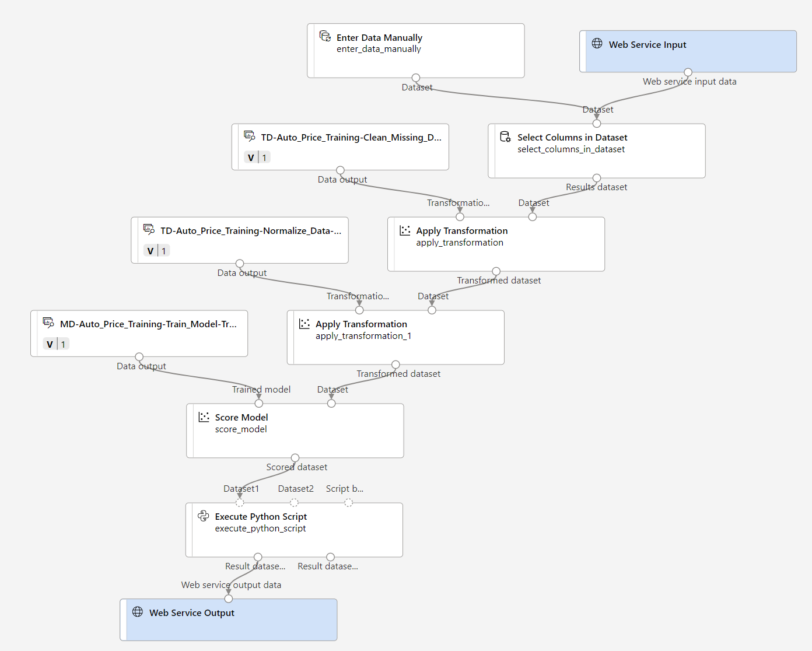

---
lab:
  title: Explorar a regressão com o designer do Azure Machine Learning
---

# Explorar a regressão com o designer do Azure Machine Learning

> **Observação** Para concluir este laboratório, você precisará de uma [assinatura do Azure](https://azure.microsoft.com/free?azure-portal=true) na qual tenha acesso administrativo.

Neste exercício, você treinará um modelo de regressão que vai prever o preço de um automóvel com base nas características dele.

## Criar um workspace do Azure Machine Learning  

1. Entre no [portal do Azure](https://portal.azure.com?azure-portal=true) usando suas credenciais da Microsoft.

1. Selecione **+ Criar um recurso**, procure *Machine Learning* e crie um recurso do **Azure Machine Learning** com um plano do *Azure Machine Learning*. Use as configurações a seguir:
    - **Assinatura**: *sua assinatura do Azure*.
    - **Grupo de recursos**: *crie ou selecione um grupo de recursos*.
    - **Nome do workspace**: *insira um nome exclusivo para o workspace*.
    - **Região**: *selecione a região geográfica mais próxima*.
    - **Conta de armazenamento**: *anote a nova conta de armazenamento padrão que será criada para o workspace*.
    - **Cofre de chaves**: *anote o novo cofre de chaves padrão que será criado para o workspace*.
    - **Application Insights**: *anote o novo recurso Application Insights padrão que será criado para o workspace*.
    - **Registro de contêiner**: nenhum (*um será criado automaticamente quando você implantar um modelo em um contêiner pela primeira vez*)

1. Selecione **Examinar + criar**e **Criar**. Aguarde até que o workspace seja criado (isso pode demorar alguns minutos) e acesse o recurso implantado.

1. Selecione **Iniciar o estúdio** (ou abra uma nova guia do navegador, acesse [https://ml.azure.com](https://ml.azure.com?azure-portal=true) e entre no Estúdio do Azure Machine Learning usando a conta Microsoft).

1. No Estúdio do Azure Machine Learning, você verá o workspace recém-criado. Se esse não for o caso, selecione o diretório do Azure no menu à esquerda. Em seguida, no novo menu à esquerda, selecione **Workspaces**, em que todos os workspaces associados ao diretório estão listados e selecione aquele que você criou para este exercício.

> **Observação** Este módulo é um dos vários que usam um workspace do Azure Machine Learning, incluindo os outros módulos do roteiro de aprendizagem [Conceitos básicos de IA do Microsoft Azure: explore ferramentas visuais para machine learning](https://docs.microsoft.com/learn/paths/create-no-code-predictive-models-azure-machine-learning/). Se você estiver usando sua assinatura do Azure, considere a possibilidade de criar o workspace uma vez e reutilizá-lo em outros módulos. Será cobrada uma pequena quantidade de armazenamento de dados em sua assinatura do Azure se o workspace do Azure Machine Learning existir na assinatura. Portanto, recomendamos que você exclua o workspace do Azure Machine Learning quando ele não for mais necessário.

## Criar computação

1. No [Estúdio do Azure Machine Learning](https://ml.azure.com?azure-portal=true), selecione o ícone **&#8801;** (um ícone de menu que se parece com uma pilha de três linhas) na parte superior esquerda para ver as várias páginas na interface (talvez seja necessário maximizar o tamanho da tela). Use essas páginas no painel esquerdo para gerenciar os recursos no workspace. Selecione a página **Computação** (em **Gerenciar**).

1. Na página **Computação**, selecione a guia **Clusters de cálculo** e adicione um novo cluster de cálculo, com as seguintes configurações para treinar um modelo de machine learning:
    - **Localização**: *selecione a mesma que a do workspace. Se essa localização não estiver listada, escolha a mais próxima de você*.
    - **Camada da máquina virtual**: dedicada
    - **Tipo de máquina virtual**: CPU
    - **Tamanho da máquina virtual**:
        - Escolha **Selecionar entre todas as opções**
        - Pesquise e selecione **Standard_DS11_v2**
    - Selecione **Avançar**
    - **Nome de computação**: *insira um nome exclusivo*
    - **Número mínimo de nós**: 0
    - **Número máximo de nós**: 2
    - **Segundos de espera antes de reduzir verticalmente**: 120
    - **Habilitar o acesso SSH**: desmarque
    - Escolha **Criar**

> **Observação** As instâncias de computação e os clusters de cálculo se baseiam em imagens de máquina virtual do Azure Standard. Para este módulo, a imagem *Standard_DS11_v2* é recomendada para atingir o equilíbrio ideal entre custo e desempenho. Se a sua assinatura tiver uma cota que não inclua essa imagem, escolha uma imagem alternativa. Mas tenha em mente que uma imagem maior pode gerar um custo maior e uma imagem menor pode não ser suficiente para concluir as tarefas. Como alternativa, peça ao administrador do Azure para estender sua cota.

O cluster de cálculo leva algum tempo para ser criado. Você pode ir para a próxima etapa enquanto aguarda.

## Criar um pipeline no Designer e adicionar um conjunto de dados

O Azure Machine Learning inclui um conjunto de dados de exemplo que você pode usar para o modelo de regressão.

1. No [Estúdio do Azure Machine Learning](https://ml.azure.com?azure-portal=true), expanda o painel esquerdo selecionando o ícone menu na parte superior esquerda da tela. Veja a página **Designer** (em **Criação**) e selecione **+** para criar um novo pipeline.

1. Altere o nome de rascunho (**Pipeline-Created-on-* date***) a **Treinamento de preço automático**.

1. Ao lado do nome do pipeline à esquerda, selecione o ícone de setas para expandir o painel se ele ainda não estiver expandido. O painel é aberto por padrão no painel **Biblioteca de ativos**, indicado pelo ícone de livros na parte superior do painel. Há uma barra de pesquisa para localizar ativos no painel e dois botões, **Dados** e **Componente**.

    

1. Selecione **Componente**. Pesquise e coloque o conjunto de dados **Dados de preços de automóvel (Brutos)** na tela.

1. Clique com o botão direito do mouse (Ctrl + clique em um Mac) no conjunto de dados **Dados de preços de automóvel (Brutos)** na tela e clique em **Visualizar dados**.

1. Examine o esquema *Saída de dados*, observando que é possível ver as distribuições das várias colunas como histogramas.

1. Role para a direita do conjunto de dados até ver a coluna **Price**, que é o rótulo que seu modelo prevê.

1. Role de volta para a esquerda e selecione o cabeçalho de coluna **perdas normalizadas**. Em seguida, examine as estatísticas dessa coluna. Observe que há alguns valores ausentes nela. Os valores ausentes limitam a utilidade da coluna para prever o rótulo **price**, de modo que você talvez queira excluí-lo do treinamento.

1. Feche a janela de **Saída de dados** para que você possa ver o conjunto de dados na tela desta maneira:

    

## Adicionar transformações de dados

Normalmente, você aplica transformações de dados para preparar os dados para modelagem. No caso de dados de preços de automóvel, você adicionará transformações para resolver os problemas que identificou ao explorar os dados.

1. No painel **Biblioteca de ativos** à esquerda, clique em **Componente**, que contêm uma ampla gama de módulos que você pode usar para transformação de dados e treinamento de modelo. Você também pode usar a barra de pesquisa para localizar os módulos rapidamente.

1. Pesquise um módulo **Selecionar Colunas no Conjunto de Dados** e posicione-o na tela, abaixo do módulo **Dados de preços de automóvel (Brutos)**. Em seguida, conecte a saída na parte inferior do módulo **Dados de preços de automóvel (Brutos)** à entrada na parte superior do módulo **Selecionar Colunas no Conjunto de Dados**, desta forma:

    

1. Clique duas vezes no módulo **Selecionar Colunas no Conjunto de Dados** para acessar um painel de configurações à direita. Selecione **Editar coluna**. Na janela **Selecionar colunas**, selecione **Por nome** e **Adicionar tudo** para adicionar todas as colunas. Remova **perdas normalizadas** para que sua seleção de coluna final tenha esta aparência:

    

1. Selecione **Salvar** e feche a janela propriedades.

No restante deste exercício, você criará um pipeline semelhante a este:


Siga as etapas restantes, usando a imagem acima para referência conforme você adiciona e configura os módulos necessários.

1. Na **Biblioteca de ativos**, procure o módulo **Limpar dados ausentes** e coloque-o sob o módulo **Selecionar colunas no conjunto de dados** na tela. Em seguida, conecte a saída do módulo **Selecionar Colunas no Conjunto de Dados** para a entrada do módulo **Limpar Dados Ausentes**.

1. Clique duas vezes no módulo **Limpar Dados Ausentes** e, no painel à direita, clique em **Editar coluna**. Depois, na janela **Colunas a serem limpas**, selecione **Com regras** e, na lista **Incluir**, escolha **Nomes de coluna**. Na caixa de nomes de coluna, insira **bore**, **stroke** e **horsepower**, desta forma:

    

1. Com o módulo **Limpar Dados Ausentes** ainda selecionado, no painel à direita, defina as seguintes configurações:
    - **Taxa mínima de valores ausentes**: 0,0
    - **Taxa máxima de valores ausentes**: 1,0
    - **Modo de limpeza**: remover linha inteira

    >**Dica** Se você exibir as estatísticas das colunas **bore**, **stroke** e **horsepower**, verá um número de valores ausentes. Essas colunas têm um número menor de valores ausentes do que **normalized-losses**, portanto, elas ainda poderão ser úteis na previsão de **price** quando você excluir as linhas com valores ausentes que existem nessas colunas do treinamento.

1. Na **Biblioteca de Ativos**, pesquise por um módulo **Normalizar Dados** e coloque-o na tela, abaixo do módulo **Limpar Dados Ausentes**. Em seguida, conecte a saída mais à esquerda do módulo **Limpar Dados Ausentes** para a entrada do módulo **Normalizar Dados**.

1. Clique duas vezes no módulo **Normalizar Dados** para exibir seu painel de parâmetros. Será necessário especificar o método de transformação e as colunas a serem transformadas. Defina o método de transformação como **MinMax**. Aplique uma regra selecionando **Editar coluna** para incluir os seguintes **Nomes de coluna**:
    - **simbologia**
    - **wheel-base**
    - **length**
    - **width**
    - **altura**
    - **peso de meio-fio**
    - **engine-size**
    - **diâmetro**
    - **curso**
    - **taxa de compactação**
    - **potência**
    - **peak-rpm**
    - **mpg na cidade**
    - **highway-mpg**

    

    >**Dica** Se você comparar os valores nas colunas **stroke**, **peak-rpm** e **city-mpg**, verá que eles são medidos em diferentes escalas e é possível que valores maiores de **peak-rpm** gerem um desvio no algoritmo de treinamento e criem uma dependência excessiva dessa coluna em comparação com outras colunas com valores mais baixos, como **stroke**. Normalmente, os cientistas de dados reduzem esse possível desvio *normalizando* colunas numéricas para que elas fiquem em escalas semelhantes.

## Executar o pipeline

Para aplicar as transformações de dados, você precisa executar o pipeline.

1. Verifique se o pipeline é semelhante a esta imagem:

    

1. Selecione **Configurar & Enviar** na parte superior da página para abrir a caixa de diálogo **Configurar trabalho de pipeline**.

1. Na página **Básico**, selecione **Criar novo** e defina o nome do experimento como **mslearn-auto-training** e selecione **Avançar** .

1. Na página **Entradas & saídas**, selecione **Avançar** sem fazer alterações.

1. Na página **Configurações de runtime**, aparece um erro porque você não tem uma computação padrão para executar o pipeline. Na lista suspensa **Selecionar tipo de computação**, selecione *Cluster de computação* e, na lista suspensa **Selecionar cluster de computação do Azure ML**, selecione o cluster de computação criado recentemente.

1. Selecione **Avançar** para examinar o trabalho de pipeline e, em seguida, selecione **Enviar** para executar o pipeline de treinamento.

1. Aguarde alguns minutos para que a execução seja concluída. Você pode marcar o status do trabalho selecionando **Trabalhos** em **Ativos**. A partir daí, selecione o trabalho **Treinamento de Preço Automático**. A partir daqui, você pode ver quando o trabalho está concluído. Depois que o trabalho for concluído, o conjunto de dados agora estará preparado para treinamento de modelo.

1. Vá para o menu à esquerda. Em **Criação**, selecione **Designer**. Em seguida, selecione o pipeline de *Treinamento de preço automático* na lista de **Pipelines**.

## Criar o pipeline de treinamento

Depois de usar as transformações de dados para prepará-los, é possível usá-las para treinar um modelo de machine learning. Execute as etapas a seguir para estender o pipeline de **Treinamento de Preço Automático**.

1. Verifique se o menu à esquerda possui **Designer** selecionado e se você retornou ao pipeline de **Treinamento de preço automático**.

1. No painel **Biblioteca de ativos** à esquerda, procure o módulo **Dividir dados** e coloque-o na tela sob o módulo **Normalizar dados**. Em seguida, conecte a saída *Conjunto de dados transformado* (à esquerda) do módulo **Normalizar dados** para a entrada do módulo **Dividir dados**.

    >**Dica** Use a barra de pesquisa para localizar os módulos rapidamente. 

1. Clique duas vezes no módulo **Dividir dados** e defina as configurações da seguinte maneira:
    - **Modo de divisão**: dividir linhas
    - **Fração das linhas no primeiro conjunto de dados de saída**: 0,7
    - **Divisão aleatória**: True
    - **Semente aleatória**: 123
    - **Divisão estratificada**: Falso

1. Na **Biblioteca de ativos**, procure o módulo **Treinar modelo** e coloque-o na tela, sob o módulo **Dividir dados**. Depois, conecte o *Conjunto de dados de resultado1* (à esquerda) do módulo **Dividir dados** à entrada *Conjunto de dados* (à direita) do módulo **Treinar modelo**.

1. O modelo que você está treinando preverá o valor de **preço**. Portanto, selecione o módulo **Treinar modelo** e modifique as configurações para definir a **Coluna rótulo** como **preço** (correspondendo ao uso de maiúsculas e ortografia com exatidão).

    O rótulo **preço** que o modelo vai prever é um valor numérico, então precisamos treinar o modelo usando um algoritmo de *regressão*.

1. Na **Biblioteca de ativos**, procure o módulo **Regressão linear** e coloque-o na tela à esquerda do módulo **Dividir dados** e acima do módulo **Treinar modelo**. Em seguida, conecte a saída dele à entrada do **Modelo não treinado** (à esquerda) do módulo **Treinar Modelo**.

    > **Observação** Há vários algoritmos que você pode usar para treinar um modelo de regressão. Para obter ajuda para escolher um deles, confira a [folha de consulta do algoritmo de machine learning para o designer do Azure Machine Learning](https://aka.ms/mlcheatsheet?azure-portal=true).

    Para testar o modelo treinado, precisamos usá-lo para *pontuar* o conjunto de dados de validação que retivemos quando dividimos os dados originais: em outras palavras, preveem rótulos para as características no conjunto de dados de validação.
 
1. Na **Biblioteca de ativos**, procure o módulo **Pontuar modelo** e coloque-o na tela, sob o módulo **Treinar modelo**. Em seguida, conecte a saída do módulo **Treinar Modelo** à entrada **Modelo treinado** (à esquerda) do módulo **Pontuar Modelo** e arraste a saída do **Conjunto de dados de resultado2** (à direita) do módulo **Dividir dados** para a entrada **Conjunto de dados** (à direita) do módulo **Pontuar Modelo**.

1. Verifique se o pipeline é semelhante a esta imagem:

    

## Executar o pipeline de treinamento

Agora você está pronto para executar o pipeline de treinamento e treinar o modelo.

1. Selecione **Configurar & Enviar** e execute o pipeline usando o experimento existente denominado **mslearn-auto-training**.

1. A execução do experimento levará 5 minutos ou mais para ser concluída. Retorne à página **Trabalhos** e selecione a execução mais recente do trabalho **Treinamento de Preço Automático**.

1. Quando a execução do experimento for concluída, clique com o botão direito do mouse no módulo **Modelo de Pontuação**, selecione **Visualizar dados** e, em seguida, **Conjunto de dados pontuado** para exibir os resultados.

1. Role para a direita e observe que ao lado da coluna **preço** (que contém os valores verdadeiros conhecidos do rótulo), há uma nova coluna chamada **Rótulos pontuados**, que contém os valores de rótulo previstos.

1. Feche a guia **scored_dataset**.

O modelo está prevendo valores para o rótulo **preço**, mas o quão confiáveis são as previsões dele? Para avaliar isso, você precisa avaliar o modelo.

## Avaliar modelo

Uma maneira de avaliar um modelo de regressão é comparar os rótulos previstos com os rótulos reais no conjunto de dados de validação a serem retidos durante o treinamento. Outra maneira é comparar o desempenho de vários modelos.

1. Abra o pipeline de **Treinamento de Preço de Automóvel** que você criou.

1. Na **Biblioteca de Ativos**, procure o módulo **Avaliar modelo**, coloque-o na tela, sob o módulo **Pontuar modelo** e conecte a saída do módulo **Pontuar modelo** à entrada do **Conjunto de dados pontuado** (à esquerda) do módulo **Avaliar modelo**.

1. Assegure-se de que o pipeline é semelhante a este:

    

1. Selecione **Configurar & Enviar** e execute o pipeline usando o experimento existente denominado **mslearn-auto-training**.

1. A execução do experimento levará alguns minutos para ser concluída. Retorne à página **Trabalhos** e selecione a execução mais recente do trabalho **Treinamento de Preço Automático**.

1. Quando a execução do teste for concluída, selecione **Detalhes do trabalho**, que abrirá outra guia. Localize o módulo **Avaliar modelo** e clique nele com o botão direito do mouse. Selecione **Dados de visualização** e, em seguida, **Resultados da avaliação**.

    

1. No painel *Evaluation_results*, examine as métricas de desempenho de regressão.
    - **MAE (Erro Médio Absoluto)**
    - **REQM (Raiz do Erro Quadrático Médio)**
    - **RSE (Erro ao Quadrado Relativo)**
    - **RAE (Erro Absoluto Relativo)**
    - **Coeficiente de Determinação (R<sup>2</sup>)**
1. Feche o painel *Evaluation_results*.

Após você ter identificado um modelo com métricas de avaliação que atendam às suas necessidades, você poderá se preparar para usar esse modelo com os dados novos.

## Criar e executar um pipeline de inferência

1. Localize o menu acima da tela e selecione **Criar pipeline de inferência**. Talvez você precise expandir para tela cheia e clicar no ícone de três pontos **...** no canto superior direito para encontrar **Criar pipeline de inferência** no menu.  

    

1. Na lista suspensa **Criar um pipeline de inferência**, clique em **Pipeline de inferência em tempo real**. Depois de alguns segundos, uma nova versão do seu pipeline denominada **Treinamento de Preço de Automóvel – inferência em tempo real** será aberta.

1. Renomeie o novo pipeline para **Prever Preço de Automóvel** e examine o novo pipeline. Ele contém uma entrada de serviço Web para que novos dados sejam enviados e uma saída de serviço Web para o retorno de resultados. Algumas das transformações e etapas de treinamento fazem parte desse pipeline. O modelo treinado será usado para pontuar os novos dados.

    Você fará as seguintes alterações no pipeline de inferência nas próximas etapas:

    

   Use a imagem para referência ao modificar o pipeline nas próximas etapas.

1. O pipeline de inferência assume que os novos dados corresponderão ao esquema dos dados de treinamento originais, de modo que o conjunto de dados **Dados de preços de automóvel (Brutos)** do pipeline de treinamento é incluído. No entanto, esses dados de entrada incluem o rótulo **preço** que o modelo prevê, o que não é intuitivo para inclusão em novos dados de carros para os quais uma previsão de preço ainda não foi feita. Exclua este módulo e o substitua com um módulo **Inserir Dados Manualmente** da seção **Dados de Entrada e Saída**.
1. Edite o módulo **Inserir Dados Manualmente** e insira os seguintes dados CSV, o que inclui valores de recursos sem rótulos para três carros (copie e cole o bloco de texto inteiro):

    ```CSV
    symboling,normalized-losses,make,fuel-type,aspiration,num-of-doors,body-style,drive-wheels,engine-location,wheel-base,length,width,height,curb-weight,engine-type,num-of-cylinders,engine-size,fuel-system,bore,stroke,compression-ratio,horsepower,peak-rpm,city-mpg,highway-mpg
    3,NaN,alfa-romero,gas,std,two,convertible,rwd,front,88.6,168.8,64.1,48.8,2548,dohc,four,130,mpfi,3.47,2.68,9,111,5000,21,27
    3,NaN,alfa-romero,gas,std,two,convertible,rwd,front,88.6,168.8,64.1,48.8,2548,dohc,four,130,mpfi,3.47,2.68,9,111,5000,21,27
    1,NaN,alfa-romero,gas,std,two,hatchback,rwd,front,94.5,171.2,65.5,52.4,2823,ohcv,six,152,mpfi,2.68,3.47,9,154,5000,19,26
    ```

1. Conecte o novo módulo **Inserir Dados Manualmente** à mesma entrada de **Conjunto de dados** do módulo **Selecionar Colunas no Conjunto de Dados** como a **Entrada do Serviço Web**.

1. Agora que você alterou o esquema dos dados de entrada para excluir o campo **preço**, é necessário remover os usos explícitos desse campo, se houver, nos módulos restantes. Selecione o módulo **Selecionar colunas no conjunto de dados** e, no painel de configurações, edite as colunas para remover o campo **preço**.

1. O pipeline de inferência inclui o módulo **Avaliar Modelo**, que não é útil para prever dados novos, portanto, exclua esse módulo.

1. A saída do módulo **Pontuar modelo** inclui todas as características de entrada e o rótulo previsto. Para modificar a saída para incluir apenas a previsão:
    - Exclua a conexão entre o módulo **Pontuar modelo** e a **Saída do serviço Web**.
    - Adicione um módulo **Executar script Python** da seção **Linguagem Python**, substituindo todo o script Python padrão pelo seguinte código (que seleciona apenas a coluna **Rótulos Pontuados** e renomeia-a para **predicted_price**):

    ```Python
    import pandas as pd

    def azureml_main(dataframe1 = None, dataframe2 = None):

        scored_results = dataframe1[['Scored Labels']]
        scored_results.rename(columns={'Scored Labels':'predicted_price'},
                        inplace=True)
     return scored_results
    ```
>**Observação**: copiar e colar pode introduzir espaços indevidos no script Python. Certifique-se de que não haja um espaço antes de *importar*, *def* ou *retornar*. Certifique-se de que haja um recuo de guia antes de *scored_results* e *scored_results.rename()*.

1. Conecte a saída do módulo **Modelo de pontuação** à entrada do **Conjunto de dados 1** (o mais à esquerda) do módulo **Executar Script Python**.

1. Conecte a saída (à esquerda) **Conjunto de dados de resultado** do módulo **Executar Script Python** ao módulo **Saída de Serviço Web**.

1. Verifique se o pipeline se assemelha à seguinte imagem:

    

1. Envie o pipeline como um novo experimento denominado **inferência automática de mslearn** no cluster de cálculo. O experimento pode demorar um pouco para ser executado.

1. Retorne à página **Trabalhos** e selecione a execução mais recente do trabalho **Treinamento de Preço Automático** (aquela relacionada ao *experimento mslearn-auto-inference*).

1. Quando o pipeline for concluído, clique com o botão direito do mouse no módulo **Executar Script Python**. Selecione **Dados de Visualização** e **Conjunto de dados de resultado** para ver os preços previstos para os três carros nos dados de entrada.

1. Feche a guia **Result_Dataset**.

Seu pipeline de inferência prevê preços para carros com base nas características deles. Agora você está pronto para publicar o pipeline para que os aplicativos cliente possam usá-lo.

## Implantar modelo

Depois de criar e testar um pipeline de inferência para inferência em tempo real, é possível publicá-lo como um serviço para uso por aplicativos cliente.

> **Observação** Neste exercício, você implantará o serviço Web em uma ACI (Instância de Contêiner do Azure). Esse tipo de computação é criado dinamicamente e é útil para desenvolvimento e teste. Para produção, crie um *cluster de inferência*, que fornece um cluster do AKS (Serviço de Kubernetes do Azure) que, por sua vez, oferece melhor escalabilidade e segurança.

## Implantar um serviço

1. Na página de execução do trabalho **Prever Preço Automático**, selecione **Implantar** na barra de menus superior.

    

1. Na tela de configuração, selecione **Implantar um novo ponto de extremidade em tempo real** usando as seguintes configurações:
    - **Nome**: prever preço de automóvel
    - **Descrição**: regressão automática de preços
    - **Tipo de computação**: instância de Contêiner do Azure

1. Selecione **Implantar** e aguarde alguns minutos para que o serviço Web seja implantado.

## Teste o serviço

1. Na página **Pontos de extremidade**, abra o ponto de extremidade em tempo real **prever preço de automóvel**.

    

1. Quando o ponto de extremidade de **previsão automática de preços** abrir, selecione **Testar**. Vamos usá-lo para testar nosso modelo com novos dados. Exclua os dados atuais em **Inserir dados para testar o ponto de extremidade**. Copie e cole os dados abaixo na seção de dados:  

    ```json
    {
    "Inputs": {
                "WebServiceInput0":
                [
                    {
                        "symboling": 3,
                        "normalized-losses": 1.0,
                        "make": "alfa-romero",
                        "fuel-type": "gas",
                        "aspiration": "std",
                        "num-of-doors": "two",
                        "body-style": "convertible",
                        "drive-wheels": "rwd",
                        "engine-location": "front",
                        "wheel-base": 88.6,
                        "length": 168.8,
                        "width": 64.1,
                        "height": 48.8,
                        "curb-weight": 2548,
                        "engine-type": "dohc",
                        "num-of-cylinders": "four",
                        "engine-size": 130,
                        "fuel-system": "mpfi",
                        "bore": 3.47,
                        "stroke": 2.68,
                        "compression-ratio": 9,
                        "horsepower": 111,
                        "peak-rpm": 5000,
                        "city-mpg": 21,
                        "highway-mpg": 27
                    }
                ]
            },
    "GlobalParameters": {}
    }
    ```

1. Selecione **Testar**. No lado direito da tela, você deverá ver a saída **"predicted_price"**. A saída é o preço previsto para um veículo com os recursos de entrada específicos definidos nos dados.

    

Vamos revisar o que você fez. Você limpou e transformou um conjunto de dados de automóveis e, em seguida, usou os *recursos* do carro para treinar um modelo. O modelo prevê o preço de um automóvel, que é o *rótulo*.

Você também testou um serviço que está pronto para ser conectado a um aplicativo cliente, usando as credenciais na guia **Consumir**. Vamos encerrar o laboratório aqui. Fique à vontade para continuar experimentando o serviço que você acabou de implantar.

## Limpar

O serviço Web que você criou está hospedado em uma *Instância de Contêiner do Azure*. Se você não pretender experimentá-lo ainda mais, exclua o ponto de extremidade para evitar o acúmulo de uso desnecessário do Azure. Você também deve excluir o cluster de cálculo.

1. No [estúdio do Azure Machine Learning](https://ml.azure.com?azure-portal=true), na guia **Pontos de Extremidade**, selecione o ponto de extremidade **prever preço de automóvel**. Depois, selecione **Excluir** e confirme que você deseja excluir o ponto de extremidade.

1. Na página **Computação**, na guia **Clusters de cálculo**, selecione a instância de computação e escolha **Excluir**.

>**Observação** Excluir sua computação garante que a assinatura não seja cobrada pelos recursos de computação. No entanto, você receberá a cobrança de uma pequena quantidade de armazenamento de dados, desde que o workspace do Azure Machine Learning exista em sua assinatura. Se tiver terminado de explorar o Azure Machine Learning, exclua o workspace do Azure Machine Learning e os recursos associados. No entanto, se você planeja concluir qualquer outro laboratório desta série, será necessário recriá-lo.
>
> Para excluir seu workspace:
>
> 1. No [portal do Azure](https://portal.azure.com?azure-portal=true), na página **Grupos de recursos**, abra o grupo de recursos que você especificou ao criar seu Workspace do Azure Machine Learning.
> 1. Clique em **Excluir grupo de recursos**, digite o nome do grupo de recursos para confirmar que deseja excluí-lo e selecione **Excluir**.
