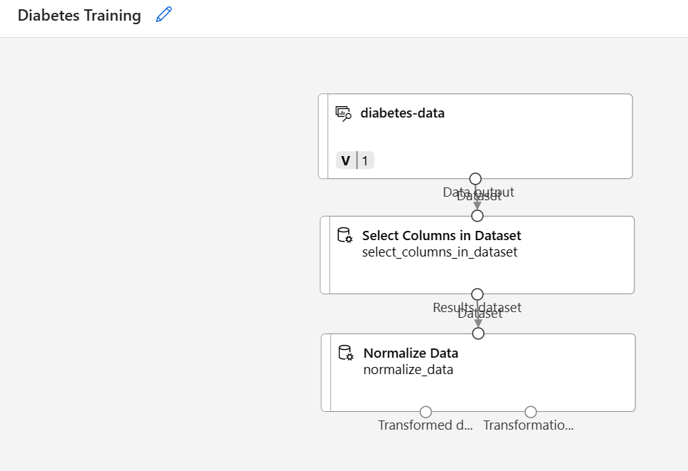

---
lab:
  title: Explorar a classificação com o designer do Azure Machine Learning
---

# <a name="explore-classification-with-azure-machine-learning-designer"></a>Explorar a classificação com o designer do Azure Machine Learning

> **Observação** Para concluir este laboratório, você precisará de uma [assinatura do Azure](https://azure.microsoft.com/free?azure-portal=true) na qual tenha acesso administrativo.

## <a name="create-an-azure-machine-learning-workspace"></a>Criar um workspace do Azure Machine Learning  

1. Entre no [portal do Azure](https://portal.azure.com?azure-portal=true) usando suas credenciais da Microsoft.

1. Selecione **+ Criar um recurso**, procure *Machine Learning* e crie um recurso do **Azure Machine Learning** com um plano do *Azure Machine Learning*. Use as configurações a seguir:
    - **Assinatura**: *sua assinatura do Azure*.
    - **Grupo de recursos**: *crie ou selecione um grupo de recursos*.
    - **Nome do workspace**: *insira um nome exclusivo para o workspace*.
    - **Região**: *selecione a região geográfica mais próxima*.
    - **Conta de armazenamento**: *anote a nova conta de armazenamento padrão que será criada para o workspace*.
    - **Cofre de chaves**: *anote o novo cofre de chaves padrão que será criado para o workspace*.
    - **Application Insights**: *anote o novo recurso Application Insights padrão que será criado para o workspace*.
    - **Registro de contêiner**: nenhum (*um será criado automaticamente quando você implantar um modelo em um contêiner pela primeira vez*)

1. Selecione **Examinar + criar**e **Criar**. Aguarde até que o workspace seja criado (isso pode demorar alguns minutos) e acesse o recurso implantado.

1. Selecione **Iniciar o estúdio** (ou abra uma nova guia do navegador, acesse [https://ml.azure.com](https://ml.azure.com?azure-portal=true) e entre no Estúdio do Azure Machine Learning usando a conta Microsoft).

1. No Estúdio do Azure Machine Learning, você verá o workspace recém-criado. Se esse não for o caso, clique em **Microsoft** no menu à esquerda. Depois, no novo menu à esquerda, selecione **Workspaces**, em que todos os workspaces associados à assinatura estão listados. Escolha o que você criou para este exercício. 

> **Observação** Este módulo é um dos vários que usam um workspace do Azure Machine Learning, incluindo os outros módulos do roteiro de aprendizagem [Conceitos básicos de IA do Microsoft Azure: explore ferramentas visuais para machine learning](https://docs.microsoft.com/learn/paths/create-no-code-predictive-models-azure-machine-learning/). Se você estiver usando sua assinatura do Azure, considere a possibilidade de criar o workspace uma vez e reutilizá-lo em outros módulos. Será cobrada uma pequena quantidade de armazenamento de dados em sua assinatura do Azure se o workspace do Azure Machine Learning existir na assinatura. Portanto, recomendamos que você exclua o workspace do Azure Machine Learning quando ele não for mais necessário.

## <a name="create-compute"></a>Criar computação

1. No [Estúdio do Azure Machine Learning](https://ml.azure.com?azure-portal=true), selecione as três linhas na parte superior esquerda para ver as várias páginas na interface (talvez seja necessário maximizar o tamanho da tela). Use essas páginas no painel esquerdo para gerenciar os recursos no workspace. Selecione a página **Computação** (em **Gerenciar**).

1. Na página **Computação**, selecione a guia **Clusters de cálculo** e adicione um novo cluster de cálculo com as configurações a seguir. Você o usará para treinar um modelo de machine learning:
    - **Localização**: *selecione a mesma que a do workspace. Se essa localização não estiver listada, escolha a mais próxima de você*.
    - **Camada da máquina virtual**: dedicada
    - **Tipo de máquina virtual**: CPU
    - **Tamanho da máquina virtual**:
        - Escolha **Selecionar entre todas as opções**
        - Pesquise e selecione **Standard_DS11_v2**
    - Selecione **Avançar**
    - **Nome da computação**: *insira um nome exclusivo*.
    - **Número mínimo de nós**: 0
    - **Número máximo de nós**: 2
    - **Segundos de espera antes de reduzir verticalmente**: 120
    - **Habilitar o acesso SSH**: desmarque
    - Escolha **Criar**

> **Observação** As instâncias de computação e os clusters de cálculo se baseiam em imagens de máquina virtual do Azure Standard. Para este módulo, a imagem *Standard_DS11_v2* é recomendada para atingir o equilíbrio ideal entre custo e desempenho. Se a sua assinatura tiver uma cota que não inclua essa imagem, escolha uma imagem alternativa. Mas tenha em mente que uma imagem maior pode gerar um custo maior e uma imagem menor pode não ser suficiente para concluir as tarefas. Como alternativa, peça ao administrador do Azure para estender sua cota.

O cluster de cálculo leva algum tempo para ser criado. Você pode ir para a próxima etapa enquanto aguarda.

## <a name="create-a-pipeline-in-designer"></a>Criar um pipeline no Designer

Para começar a usar o designer do Azure Machine Learning, primeiro você precisa criar um pipeline e adicionar o conjunto de dados com o qual deseja trabalhar.

1. No [Estúdio do Azure Machine Learning](https://ml.azure.com?azure-portal=true), selecione as três linhas no canto superior esquerdo da tela para expandir o painel. Veja a página **Designer** (em **Criar**) e selecione **+** para criar um pipeline.

1. No canto superior direito da tela, selecione **Configurações**. Se o painel **Configurações** não estiver visível, selecione o ícone de engrenagem ao lado do nome do pipeline na parte superior.

1. Em **Configurações**, você precisa especificar um destino de computação no qual executar o pipeline. Em **Selecionar tipo de computação**, selecione **Cluster de computação**. Depois, em **Selecionar cluster de cálculo do Azure ML**, escolha o cluster de cálculo que já foi criado.

1. Em **Configurações**, em **Detalhes do Rascunho**, altere o nome do rascunho (**Pipeline-Created-on-* date***) para **Treinamento de diabetes**.

1. Selecione o ícone de fechamento no canto superior direito do painel **Configurações** e clique em **Salvar**.

    

## <a name="create-a-dataset"></a>Criar um conjunto de dados

1. No [Estúdio do Azure Machine Learning](https://ml.azure.com?azure-portal=true), selecione as três linhas no canto superior esquerdo da tela para expandir o painel. Exiba a página **Dados** (em **Ativos**). A página de Dados contém arquivos ou tabelas de dados específicos com os quais você trabalhará no Azure ML. Você também pode criar conjuntos de dados nessa página.

1. Na página **Dados**, na guia **Ativos de dados**, selecione **Criar**. Depois, defina um ativo de dados com as seguintes configurações:
    * **Tipo de dados**:
        * **Nome**: dados-de-diabetes
        * **Descrição**: dados de diabetes
        * **Tipo de conjunto de dados**: tabular
    * **Fonte de dados**: de arquivos da Web
    * **URL da Web**: 
        * **URL da Web**: https://aka.ms/diabetes-data
        * **Ignorar validação de dados**: *não selecionar*
    * **Configurações**:
        * **Formato de arquivo**: delimitado
        * **Delimitador**: vírgula
        * **Codificação**: UTF-8
        * **Cabeçalhos de coluna**: somente o primeiro arquivo tem cabeçalhos
        * **Ignorar linhas**: Nenhum
        * **O conjunto de dados contém dados multilinhas**: *não selecione*
    * **Esquema**:
        * incluir todas as colunas que não sejam **Caminho**
        * Examinar os tipos detectados automaticamente
    * **Revisão**
        * Escolha **Criar**

1. Depois que o conjunto de dados tiver sido criado, abra-o e exiba a página **Explorar** para ver uma amostra dos dados. Esses dados representam detalhes de pacientes que foram testados para diabetes.

### <a name="load-data-to-canvas"></a>Carregar dados na tela

1. Retorne ao pipeline selecionando **Designer** no menu à esquerda. Na página **Designer**, selecione o pipeline **Treinamento de diabetes**.

1. Então, no projeto, ao lado do nome do pipeline à esquerda, selecione o ícone de setas para expandir o painel se ele ainda não estiver expandido. O painel é aberto por padrão no painel **Biblioteca de ativos**, indicado pelo ícone de livros na parte superior do painel. Observe que há uma barra de pesquisa para localizar os ativos. Observe dois botões, **Dados** e **Componente**.

    

1. Clique em **Dados**. Pesquise pelo conjunto de dados **diabetes-data** e coloque-o na tela.

1. Clique com o botão direito do mouse (CTRL + clique no Mac) no conjunto de dados **diabetes-data** na tela e clique em **Visualizar dados**.

1. Examine o esquema dos dados na tabela *Perfil*, observando que é possível ver as distribuições das várias colunas como histogramas.

1. Role para baixo, selecione o título de coluna para a coluna **Diabético** e observe que ela contém dois valores, **0** e **1**. Esses valores representam as duas classes possíveis para o *rótulo* que seu modelo preverá, com um valor de **0** significando que o paciente não tem diabetes e um valor de **1** significando que o paciente é diabético.

1. Role de volta para cima e examine as outras colunas, que representam as *características* que serão usadas para prever o rótulo. Observe que a maioria dessas colunas é numérica, mas cada recurso está na própria escala. Por exemplo, os valores de **Idade** variam de 21 a 77, enquanto os valores de **DiabetesPedigree** variam de 0,078 a 2,3016. Ao treinar um modelo de machine learning, às vezes é possível que os valores maiores dominem a função preditiva resultante, reduzindo a influência das características em uma escala menor. Normalmente, os cientistas de dados reduzem esse possível desvio *normalizando* colunas numéricas para que elas fiquem em escalas semelhantes.

1. Feche a guia **Visualização de resultados de diabetes-data** para ver o conjunto de dados na tela desta maneira:

    

## <a name="add-transformations"></a>Adicionar transformações

Para treinar um modelo, você precisa aplicar algumas transformações de pré-processamento aos dados.

1. No painel **Biblioteca de ativos** à esquerda, clique em **Componente**, que contêm uma ampla gama de módulos que você pode usar para transformação de dados e treinamento de modelo. Você também pode usar a barra de pesquisa para localizar os módulos rapidamente.

    

1. Localize o módulo **Selecionar Colunas no Conjunto de Dados** e coloque-o na tela, abaixo do conjunto de dados **diabetes-data**. Em seguida, conecte a saída da parte inferior do conjunto de dados **diabetes-data** à entrada na parte superior do módulo **Selecionar Colunas no Conjunto de Dados**.

1. Localize o módulo **Normalizar Dados** e coloque-o na tela, abaixo do módulo **Selecionar Colunas no Conjunto de Dados**. Em seguida, conecte a saída da parte inferior do módulo **Selecionar Colunas no Conjunto de Dados** à entrada na parte superior do módulo **Normalizar Dados**, desta forma:

    

1. Clique duas vezes no módulo **Normalizar Dados** para ver as respectivas configurações, observando que é necessário especificar o método de transformação e as colunas a serem transformadas. 

1. Defina o *Método de transformação* como **MinMax** e o *Usar 0 para colunas constantes quando marcadas* como **True**. Edite as colunas para incluir as seguintes colunas por nome, conforme mostrado na imagem:
    - **Gravidezes**
    - **PlasmaGlucose**
    - **DiastolicBloodPressure**
    - **TricepsThickness**
    - **SerumInsulin**
    - **BMI**
    - **DiabetesPedigree**
    - **Age**

    

A transformação de dados está normalizando as colunas numéricas para colocá-las na mesma escala, o que deve ajudar a evitar que colunas com valores grandes dominem o treinamento do modelo. Normalmente, você aplicaria um número grande de transformações de pré-processamento como essa para preparar seus dados para treinamento, mas vamos manter as coisas simples neste exercício.

## <a name="run-the-pipeline"></a>Executar o pipeline

Para aplicar suas transformações de dados, você precisa executar o pipeline como um experimento.

1. Selecione **Enviar** e execute o pipeline como um novo experimento denominado **treinamento de diabetes mslearn** em seu cluster de cálculo.

1. Aguarde alguns minutos para que a execução seja concluída.

    

    Observe que o painel esquerdo agora está no painel **Trabalhos Enviados**. Você saberá quando a execução for concluída porque o status do trabalho será alterado para **Concluído**.

## <a name="view-the-transformed-data"></a>Ver os dados transformados

1. Quando a execução for concluída, o conjunto de dados estará preparado para treinamento de modelo. Clique em **Detalhes do trabalho**. Você será direcionado a uma nova guia.

1. Clique com o botão direito do mouse (Ctrl + clique no Mac) no módulo **Normalizar dados** na tela e clique em **Visualizar dados**. Selecione **Conjunto de dados transformados**.

1. Veja os dados, observando que as colunas numéricas selecionadas foram normalizadas para uma escala comum.

1. Feche a visualização dos resultados dos dados normalizados. Retornar à guia anterior.

Depois de usar as transformações de dados para prepará-los, é possível usá-las para treinar um modelo de machine learning.

## <a name="add-training-modules"></a>Adicionar módulos de treinamento

É uma prática comum treinar o modelo usando um subconjunto dos dados, simultaneamente retendo alguns dados com os quais testar o modelo treinado. Isso permite que você compare os rótulos que o modelo prevê com os rótulos reais conhecidos no conjunto de dados original.

Neste exercício, você percorrerá algumas etapas para estender o pipeline de **Treinamento sobre a Diabetes**, conforme mostrado aqui:


Siga as etapas abaixo, usando a imagem acima para referência, à medida que você adicionar e configurar os módulos necessários.

1. Abra o pipeline de **Treinamento de Diabetes** que você criou na unidade anterior se ele ainda não estiver aberto.

1. No painel **Biblioteca de ativos** à esquerda, em **Componentes**, procure o módulo **Dividir dados** e coloque-o na tela sob o módulo **Normalizar dados**. Em seguida, conecte a saída *Conjunto de dados transformado* (à esquerda) do módulo **Normalizar dados** para a entrada do módulo **Dividir dados**.

    >**Dica** Use a barra de pesquisa para localizar os módulos rapidamente.

1. Selecione o módulo **Dividir dados** e defina as configurações dele da seguinte maneira:
    * **Modo de divisão**: dividir linhas
    * **Fração das linhas no primeiro conjunto de dados de saída**: 0,7
    * **Divisão aleatória**: True
    * **Semente aleatória**: 123
    * **Divisão estratificada**: Falso

1. Na **Biblioteca de ativos**, procure o módulo **Treinar modelo** e coloque-o na tela, sob o módulo **Dividir dados**. Depois, conecte o *Conjunto de dados de resultado1* (à esquerda) do módulo **Dividir dados** à entrada *Conjunto de dados* (à direita) do módulo **Treinar modelo**.

1. O modelo que estamos treinando preverá o valor de **Diabético**. Portanto, selecione o módulo **Treinar Modelo** e modifique as configurações dele para definir a **coluna Rótulo** como **Diabético**.

    O rótulo **Diabético** que o modelo vai prever é uma classe (0 ou 1), portanto, precisamos treinar o modelo usando um algoritmo de *classificação*. Especificamente, há duas classes possíveis, portanto, precisamos de um algoritmo de *classificação binária*.

1. Na **Biblioteca de ativos**, procure o módulo **Regressão logística de duas classes** e coloque-o na tela, à esquerda do módulo **Dividir dados** e acima do módulo **Treinar modelo**. Em seguida, conecte a saída dele à entrada do **Modelo não treinado** (à esquerda) do módulo **Treinar Modelo**.

   Para testar o modelo treinado, precisamos usá-lo para *pontuar* o conjunto de dados de validação que retivemos quando dividimos os dados originais: em outras palavras, preveem rótulos para as características no conjunto de dados de validação.

1. Na **Biblioteca de ativos**, procure o módulo **Pontuar modelo** e coloque-o na tela, sob o módulo **Treinar modelo**. Em seguida, conecte a saída do módulo **Treinar Modelo** à entrada **Modelo treinado** (à esquerda) do módulo **Pontuar Modelo** e conecte a saída do **Conjunto de dados de resultado2** (à direita) do módulo **Dividir dados** à entrada **Conjunto de dados** (à direita) do módulo **Pontuar Modelo**.

## <a name="run-the-training-pipeline"></a>Executar o pipeline de treinamento

Agora você está pronto para executar o pipeline de treinamento e treinar o modelo.

1. Selecione **Enviar** e execute o pipeline usando o experimento existente denominado **treinamento de diabetes mslearn**.

1. Aguarde a conclusão da execução do experimento. Isso pode levar cinco minutos ou mais.

1. Quando a execução do teste for concluída, selecione **Detalhes do trabalho**. Você será direcionado a uma nova guia.

1. Na nova guia, clique com o botão direito do mouse (Ctrl + clique no Mac) no módulo **Modelo de pontuação** na tela e clique em **Visualizar dados**. Selecione **Conjunto de dados pontuado** para exibir os resultados.

1. Role para a direita e observe que ao lado da coluna **Diabético** (que contém os valores verdadeiros conhecidos do rótulo), há uma nova coluna denominada **Rótulos Pontuados**, que contém os valores de rótulo previstos, além de uma coluna chamada **Probabilidades Pontuadas**, que contém um valor de probabilidade entre 0 e 1. Isso indica a probabilidade de uma previsão *positiva*, portanto, as probabilidades maiores que 0,5 resultam em um rótulo previsto de ***1*** (diabético), enquanto as probabilidades entre 0 e 0,5 resultam em um rótulo previsto de ***0*** (não diabético).

1. Feche a guia **Visualização de resultados de Pontuar modelo**.

O modelo está prevendo valores para o rótulo **Diabético**, mas o quão confiáveis são as previsões dele? Para avaliar isso, você precisa avaliar o modelo.

Os dados de validação que você reteve e usou para pontuar o modelo incluem os valores conhecidos para o rótulo. Portanto, para validar o modelo, é possível comparar os valores verdadeiros para o rótulo com os valores de rótulo que foram previstos quando você pontuou o conjunto de dados de validação. Com base nessa comparação, é possível calcular várias métricas que descrevem o quão bom é o desempenho do modelo.

## <a name="add-an-evaluate-model-module"></a>Adicionar um módulo Avaliar Modelo

1. Abra o pipeline de **Treinamento de Diabetes** que você criou.

1. Na **Biblioteca de Ativos**, procure o módulo **Avaliar modelo**, coloque-o na tela, sob o módulo **Pontuar modelo** e conecte a saída do módulo **Pontuar modelo** à entrada do **Conjunto de dados pontuado** (à esquerda) do módulo **Avaliar modelo**.

1. Assegure-se de que o pipeline é semelhante a este:

    

1. Selecione **Enviar** e execute o pipeline usando o experimento existente denominado **treinamento de diabetes mslearn**.

1. Aguarde a conclusão da execução do experimento.

1. Quando a execução do teste for concluída, selecione **Detalhes do trabalho**. Você será direcionado a uma nova guia.

1. Na nova janela, clique com o botão direito do mouse (Ctrl + clique no Mac) no módulo **Avaliar modelo** na tela e clique em **Visualizar dados**. Selecione **Resultados da avaliação** para exibir as métricas de desempenho. Essas métricas podem ajudar os cientistas de dados a avaliar o quão bem o modelo prevê com base nos dados de validação.

1. Role para baixo para exibir a *matriz de confusão* do modelo. Observe as contagens de valor previstas e reais para cada classe possível. 

1. Examine as métricas à esquerda da matriz de confusão, que incluem:
    - **Precisão**: Em outras palavras, que proporção das previsões de diabetes o modelo acertou?
    - **Precisão**: Em outras palavras, de todos os pacientes que *o modelo previu* como tendo diabetes, o percentual de tempo que o modelo está correto. 
    - **Recall**: Em outras palavras, de todos os pacientes *que realmente têm* diabetes, quantos casos de diabetes o modelo identificou corretamente?
    - **Medida F1**

1. Use o controle deslizante **Threshold** localizado acima da lista de métricas. Tente mover o controle deslizante de limite e observe o efeito sobre a matriz de confusão. Se você movê-lo para a esquerda até o final (0), a métrica de Recuperação se tornará 1 e, se você movê-la até o fim para a direita (1), a métrica de Recuperação se tornará 0.

1. Veja acima do controle deslizante Threshold na **curva ROC** e na métrica **AUC** listadas com as outras métricas abaixo. Para ter uma ideia de como essa área representa o desempenho do modelo, imagine uma linha diagonal reta da parte inferior esquerda para a parte superior direita do gráfico ROC. Isso representa o desempenho esperado se você acabou de adivinhar ou lançar uma moeda para cada paciente: você poderia esperar acertar metade das vezes e errar a outra metade, portanto, a área sob a linha diagonal representa um AUC de 0,5. Se o AUC de seu modelo for maior que esse para um modelo de classificação binária, o modelo terá um desempenho melhor do que uma estimativa aleatória.

1. Feche a guia **Visualização de resultados de Avaliar Modelo**.

O desempenho desse modelo não é tão bom, em parte porque realizamos apenas um mínimo de engenharia de recursos e pré-processamento. É possível tentar um algoritmo de classificação diferente, como a **floresta de decisão de duas classes**, e comparar os resultados. É possível conectar as saídas do módulo **Dividir Dados** a vários módulos **Treinar Modelo** e **Pontuar Modelo** e conectar um segundo módulo **Pontuar Modelo** ao módulo **Avaliar Modelo** para ver uma comparação lado a lado. O objetivo do exercício é simplesmente apresentar a você a classificação e a interface do designer do Azure Machine Learning, não treinar um modelo perfeito!

## <a name="create-an-inference-pipeline"></a>Criar um pipeline de inferência

1. No Estúdio do Azure Machine Learning, selecione as três linhas no canto superior esquerdo da tela para expandir o painel. Clique em **Trabalhos** (em **Ativos**) para exibir todos os trabalhos executados. Selecione o teste **mslearn-diabetes-training** e o pipeline **Treinamento de diabetes**.

1. Localize o menu acima da tela e clique em **Criar pipeline de inferência**. Talvez você precise expandir para tela cheia e clicar no ícone de três pontos **...** no canto superior direito para encontrar **Criar pipeline de inferência** no menu.  

    

1. Na lista suspensa **Criar um pipeline de inferência**, clique em **Pipeline de inferência em tempo real**. Depois de alguns segundos, uma nova versão do seu pipeline denominada **Treinamento de Diabetes – inferência em tempo real** será aberta.

1. Navegue até **Configurações** no menu superior direito. Em **Detalhes do rascunho**, renomeie o novo pipeline como **Prever Diabetes** e examine-o. Algumas das transformações e etapas de treinamento fazem parte desse pipeline. O modelo treinado será usado para pontuar os novos dados. O pipeline também contém uma saída de serviço Web para retornar resultados. 

    Você fará as seguintes alterações no pipeline de inferência:

    
    
    - Adicione um componente de **entrada de serviço Web** para que novos dados sejam enviados.
    - Substitua o conjunto de dados **diabetes-data** por um módulo **Inserir Dados Manualmente** que não inclui a coluna de rótulo (**Diabético**).
    - Edite as colunas selecionadas no módulo **Selecionar Colunas no Conjunto de Dados**.
    - Remova o módulo **Avaliar Modelo**.
    - Insira um módulo **Executar script Python** antes da saída do serviço Web para retornar apenas a ID do paciente, o valor do rótulo previsto e a probabilidade.

1. O pipeline não inclui automaticamente um componente **Entrada de serviço Web** para modelos criados com base em conjuntos de dados personalizados. Procure um componente **Entrada de serviço Web** na biblioteca de ativos e coloque-o na parte superior do pipeline. Conecte a saída do componente **Entrada de serviço Web** à entrada do lado direito do componente **Aplicar transformação** que já está na tela.

1. O pipeline de inferência assume que os novos dados corresponderão ao esquema dos dados de treinamento originais, de modo que o conjunto de dados **dados de diabetes** do pipeline de treinamento é incluído. No entanto, esses dados de entrada incluem o rótulo **Diabético** que o modelo prevê, que não está incluído em novos dados de pacientes para os quais uma previsão de diabetes ainda não foi feita. Exclua esse módulo e substitua-o por um módulo **Inserir Dados Manualmente**, contendo os seguintes dados CSV, o que inclui valores de recursos sem rótulos para três novas observações de pacientes:

    ```CSV
    PatientID,Pregnancies,PlasmaGlucose,DiastolicBloodPressure,TricepsThickness,SerumInsulin,BMI,DiabetesPedigree,Age
    1882185,9,104,51,7,24,27.36983156,1.350472047,43
    1662484,6,73,61,35,24,18.74367404,1.074147566,75
    1228510,4,115,50,29,243,34.69215364,0.741159926,59
    ```

1. Conecte o novo módulo **Inserir Dados Manualmente** à mesma entrada de **Conjunto de dados** do módulo **Aplicar Transformação** como a **Entrada do Serviço Web**.

1. Edite o módulo **Selecionar Colunas no Conjunto de Dados**. Remova **Diabetic** das *Colunas Selecionadas*. 

1. O pipeline de inferência inclui o módulo **Avaliar Modelo**, que não é útil para prever dados novos, portanto, exclua esse módulo.

1. A saída do módulo **Pontuar Modelo** inclui todas as características de entrada, bem como o rótulo previsto e a pontuação de probabilidade. Para limitar a saída somente para a previsão e a probabilidade:
    - Exclua a conexão entre o módulo **Pontuar modelo** e a **Saída do serviço Web**.
    - Adicione um módulo **Executar Script Python**, substituindo todo o script Python padrão pelo seguinte código (que seleciona apenas as colunas **PatientID**, **Rótulos Pontuados** e **Probabilidades Pontuadas** e as renomeia corretamente):

```Python
import pandas as pd

def azureml_main(dataframe1 = None, dataframe2 = None):

    scored_results = dataframe1[['Scored Labels', 'Scored Probabilities']]
    scored_results.rename(columns={'Scored Labels':'DiabetesPrediction',
                                'Scored Probabilities':'Probability'},
                        inplace=True)
    return scored_results
```

1. Conecte a saída módulo **Pontuar modelo** à entrada **Dataset1** (mais à esquerda) de **Executar script Python** e conecte a saída do módulo **Executar script Python** à **Saída do serviço Web**.

1. Verifique se o pipeline se assemelha à seguinte imagem:

    

1. Execute o pipeline como um novo experimento denominado **inferência de diabetes mslearn** no cluster de cálculo. O experimento pode demorar um pouco para ser executado.

1. Quando o pipeline for concluído, selecione **Detalhes do trabalho**. Na nova guia, clique com o botão direito do mouse no módulo **Executar script Python**. Selecione **Visualizar dados** e o **Conjunto de dados de resultado** para ver os rótulos e as probabilidades previstos para as três observações de pacientes nos dados de entrada.

Seu pipeline de inferência prevê se os pacientes correm ou não risco de ter diabetes com base nas características dele. Agora você está pronto para publicar o pipeline para que os aplicativos cliente possam usá-lo.

Depois de criar e testar um pipeline de inferência para inferência em tempo real, é possível publicá-lo como um serviço para uso por aplicativos cliente.

> **Observação** Neste exercício, você implantará o serviço Web em uma ACI (Instância de Contêiner do Azure). Esse tipo de computação é criado dinamicamente e é útil para desenvolvimento e teste. Para produção, você deve criar um *cluster de inferência*, que gera um cluster AKS (Serviço de Kubernetes do Azure), o qual, por sua vez, fornece melhor escalabilidade e segurança.

## <a name="deploy-a-service"></a>Implantar um serviço

1. Veja o pipeline de inferência **Prever Diabetes** criado na unidade anterior.

1. Selecione **Detalhes do trabalho** no painel esquerdo. Isso abrirá outra janela.

    

1. Na nova janela, selecione **Implantar**.

    

1. No canto superior direito, selecione **Implantar** e implante um **novo ponto de extremidade em tempo real** usando as seguintes configurações: 
    -  **Nome**: prever diabetes
    -  **Descrição**: Classificar diabetes
    - **Tipo de computação**: instância de Contêiner do Azure

1. Aguarde até que o serviço Web seja implantado. Isso pode levar vários minutos. O status da implantação é mostrado na parte superior esquerda da interface do designer.

## <a name="test-the-service"></a>Teste o serviço

1. Na página **Pontos de extremidade**, abra o ponto de extremidade em tempo real **prever diabetes**.

    

1. Quando o ponto de extremidade **prever diabetes** for aberto, selecione a guia **Testar**. Vamos usá-la para testar nosso modelo com novos dados. Exclua os dados atuais em **Inserir dados para testar o ponto de extremidade em tempo real**. Copie e cole os dados abaixo na seção de dados:  

    ```JSON
    {
      "Inputs": {
        "input1":
          [
            { "PatientID": 1882185,
              "Pregnancies": 9,
              "PlasmaGlucose": 104,
              "DiastolicBloodPressure": 51,
              "TricepsThickness": 7,
              "SerumInsulin": 24,
              "BMI": 27.36983156,
              "DiabetesPedigree": 1.3504720469999998,
              "Age": 43 }
            ]
          },
      "GlobalParameters":  {}
    }
    ```

    > **Observação** O JSON acima define as características de um paciente e usa o serviço **predict-diabetes** que você criou para prever um diagnóstico de diabetes.

1. Selecione **Testar**. No lado direito da tela, você deverá ver a saída **'DiabetesPrediction'**. A saída será 1 se a previsão for de que o paciente tem diabetes e 0 se for de que ele não tem.  

    

    Você acabou de testar um serviço que está pronto para ser conectado a um aplicativo cliente usando as credenciais na guia **Consumir**. Vamos encerrar o laboratório aqui. Fique à vontade para continuar experimentando o serviço que você acabou de implantar.

## <a name="clean-up"></a>Limpar

O serviço Web que você criou está hospedado em uma *Instância de Contêiner do Azure*. Se você não pretender experimentá-lo ainda mais, exclua o ponto de extremidade para evitar o acúmulo de uso desnecessário do Azure.

1. No [estúdio do Azure Machine Learning](https://ml.azure.com?azure-portal=true), na guia **Pontos de extremidade**, selecione o ponto de extremidade **prever diabetes**. Depois, selecione **Excluir** e confirme que deseja excluir o ponto de extremidade.

1. Na página **Computação**, na guia **Clusters de cálculo**, selecione a instância de computação e escolha **Excluir**.

>**Observação** A interrupção da computação garante que a assinatura não seja cobrada pelos recursos de computação. No entanto, você receberá a cobrança de uma pequena quantidade de armazenamento de dados, desde que o workspace do Azure Machine Learning exista em sua assinatura. Se tiver terminado de explorar o Azure Machine Learning, exclua o workspace do Azure Machine Learning e os recursos associados. No entanto, se você planeja concluir qualquer outro laboratório desta série, será necessário recriá-lo.
>
> Para excluir seu workspace:
>
> 1. No [portal do Azure](https://portal.azure.com?azure-portal=true), na página **Grupos de recursos**, abra o grupo de recursos que você especificou ao criar seu Workspace do Azure Machine Learning.
> 1. Clique em **Excluir grupo de recursos**, digite o nome do grupo de recursos para confirmar que deseja excluí-lo e selecione **Excluir**.
