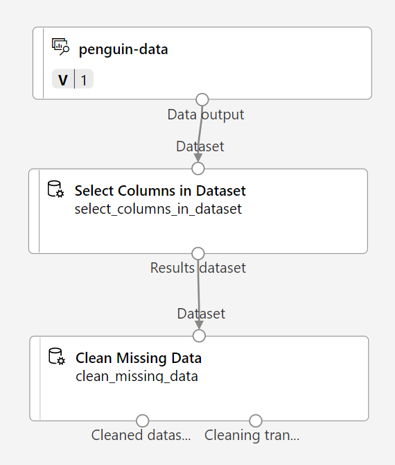
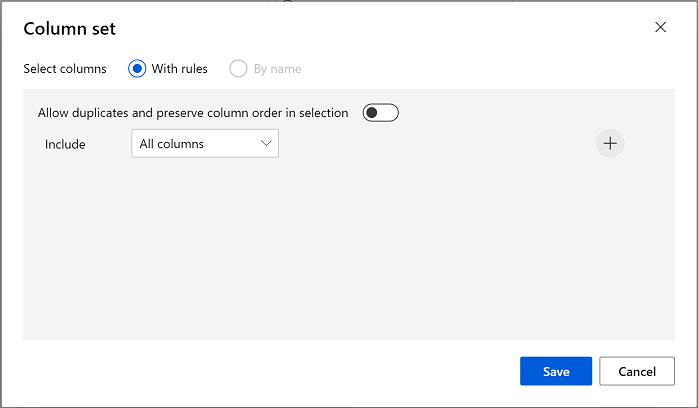
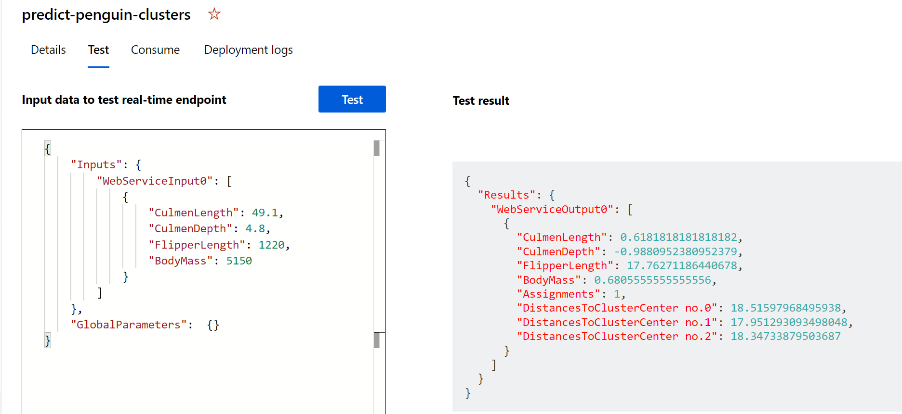

---
lab:
  title: Explorar o clustering com o designer do Azure Machine Learning
---

# Explorar o clustering com o designer do Azure Machine Learning

> **Observação** Para concluir este laboratório, você precisará de uma [assinatura do Azure](https://azure.microsoft.com/free?azure-portal=true) na qual tenha acesso administrativo.

## Criar um workspace do Azure Machine Learning  

1. Entre no [portal do Azure](https://portal.azure.com?azure-portal=true) usando suas credenciais da Microsoft.

1. Selecione **+ Criar um recurso**, procure *Machine Learning* e crie um recurso do **Azure Machine Learning** com um plano do *Azure Machine Learning*. Use as configurações a seguir:
    - **Assinatura**: *sua assinatura do Azure*.
    - **Grupo de recursos**: *crie ou selecione um grupo de recursos*.
    - **Nome do workspace**: *insira um nome exclusivo para o workspace*.
    - **Região**: *selecione a região geográfica mais próxima*.
    - **Conta de armazenamento**: *anote a nova conta de armazenamento padrão que será criada para o workspace*.
    - **Cofre de chaves**: *anote o novo cofre de chaves padrão que será criado para o workspace*.
    - **Application Insights**: *anote o novo recurso Application Insights padrão que será criado para o workspace*.
    - **Registro de contêiner**: nenhum (*um será criado automaticamente quando você implantar um modelo em um contêiner pela primeira vez*)

1. Selecione **Examinar + criar**e **Criar**. Aguarde até que o workspace seja criado (isso pode demorar alguns minutos) e acesse o recurso implantado.

1. Selecione **Iniciar o estúdio** (ou abra uma nova guia do navegador, acesse [https://ml.azure.com](https://ml.azure.com?azure-portal=true) e entre no Estúdio do Azure Machine Learning usando a conta Microsoft).

1. No Estúdio do Azure Machine Learning, você verá o workspace recém-criado. Se esse não for o caso, selecione o diretório do Azure no menu à esquerda. Em seguida, no novo menu à esquerda, selecione **Workspaces**, em que todos os workspaces associados ao diretório estão listados e selecione aquele que você criou para este exercício.

> **Observação** Este módulo é um dos vários que usam um workspace do Azure Machine Learning, incluindo os outros módulos do roteiro de aprendizagem [Conceitos básicos de IA do Microsoft Azure: explore ferramentas visuais para machine learning](https://docs.microsoft.com/learn/paths/create-no-code-predictive-models-azure-machine-learning/). Se você estiver usando sua assinatura do Azure, considere a possibilidade de criar o workspace uma vez e reutilizá-lo em outros módulos. Será cobrada uma pequena quantidade de armazenamento de dados em sua assinatura do Azure se o workspace do Azure Machine Learning existir na assinatura. Portanto, recomendamos que você exclua o workspace do Azure Machine Learning quando ele não for mais necessário.

## Criar computação

1. No [Estúdio do Azure Machine Learning](https://ml.azure.com?azure-portal=true), selecione o ícone **&#8801;** (um ícone de menu que se parece com uma pilha de três linhas) na parte superior esquerda para ver as várias páginas na interface (talvez seja necessário maximizar o tamanho da tela). Use essas páginas no painel esquerdo para gerenciar os recursos no workspace. Selecione a página **Computação** (em **Gerenciar**).

2. Na página **Computação**, selecione a guia **Clusters de cálculo** e adicione um novo cluster de cálculo com as configurações a seguir. Você o usará para treinar um modelo de machine learning:
    - **Localização**: *selecione a mesma que a do workspace. Se essa localização não estiver listada, escolha a mais próxima de você*.
    - **Camada da máquina virtual**: dedicada
    - **Tipo de máquina virtual**: CPU
    - **Tamanho da máquina virtual**:
        - Escolha **Selecionar entre todas as opções**
        - Pesquise e selecione **Standard_DS11_v2**
    - Selecione **Avançar**
    - **Nome da computação**: *insira um nome exclusivo*.
    - **Número mínimo de nós**: 0
    - **Número máximo de nós**: 2
    - **Segundos de espera antes de reduzir verticalmente**: 120
    - **Habilitar o acesso SSH**: desmarque
    - Escolha **Criar**

> **Observação** As instâncias de computação e os clusters de cálculo se baseiam em imagens de máquina virtual do Azure Standard. Para este módulo, a imagem *Standard_DS11_v2* é recomendada para atingir o equilíbrio ideal entre custo e desempenho. Se a sua assinatura tiver uma cota que não inclua essa imagem, escolha uma imagem alternativa. Mas tenha em mente que uma imagem maior pode gerar um custo maior e uma imagem menor pode não ser suficiente para concluir as tarefas. Como alternativa, peça ao administrador do Azure para estender sua cota.

O cluster de cálculo leva algum tempo para ser criado. Você pode ir para a próxima etapa enquanto aguarda.

## Criar um pipeline e adicionar um conjunto de dados

Para começar a usar o designer do Azure Machine Learning, primeiro você precisa criar um pipeline.

1. No [Estúdio do Azure Machine Learning](https://ml.azure.com?azure-portal=true), expanda o painel esquerdo selecionando o ícone menu na parte superior esquerda da tela. Veja a página **Designer** (em **Criação**) e selecione **+** para criar um novo pipeline.

1. Altere o nome do rascunho (**Pipeline-Created-on-* date***) para **Treinar Clustering de Pinguins**.

    No Azure Machine Learning, os dados para treinamento de modelos e outras operações geralmente são encapsulados em um objeto chamado de *conjunto de dados*. Neste módulo, você usará um conjunto de dados que inclui observações sobre três espécies de pinguins.

1. Exiba a página **Dados** (em **Ativos**). A página de Dados contém arquivos ou tabelas de dados específicos com os quais você trabalhará no Azure ML.

1. Na página **Dados**, na guia **Ativos de dados**, selecione **+ Criar**. Depois, defina um ativo de dados com as seguintes configurações:
    - **Tipo de dados**:
        - **Nome**: penguin-data
        - **Descrição**: dados sobre pinguins
        - **Tipo de conjunto de dados**: tabular
    - **Fonte de dados**: de arquivos da Web
    - **URL da Web**:
        - **URL da Web**: https://aka.ms/penguin-data
        - **Ignorar validação de dados**: *não selecionar*
    - **Configurações**:
        - **Formato de arquivo**: delimitado
        - **Delimitador**: vírgula
        - **Codificação**: UTF-8
        - **Cabeçalhos de coluna**: somente o primeiro arquivo tem cabeçalhos
        - **Ignorar linhas**: Nenhum
        - **O conjunto de dados contém dados multilinhas**: *não selecione*
    - **Esquema**:
        - incluir todas as colunas que não sejam **Caminho**
        - Examinar os tipos detectados automaticamente
    - **Revisão**
        - Escolha **Criar**

1. Depois que o conjunto de dados tiver sido criado, abra-o e exiba a página **Explorar** para ver uma amostra dos dados. Esses dados representam as medidas do comprimento e da profundidade do cúlmen (bico), do comprimento da nadadeira e da massa corporal referentes a diversas observações de pinguins. Três espécies de pinguins são representadas no conjunto de dados: *Adélia*, *Gentoo* e *De Barbicha*.

> **Observação** O conjunto de dados sobre pinguins usado neste exercício é um subconjunto dos dados coletados e disponibilizados pela [Dra. Kristen Gorman](https://www.uaf.edu/cfos/people/faculty/detail/kristen-gorman.php) e pela [Estação Palmer, LTER Antártida](https://pal.lternet.edu/), membro da [Rede de Pesquisa Ecológica de Longo Prazo](https://lternet.edu/).

### Carregar dados na tela

1. Retorne ao pipeline selecionando **Designer** no menu à esquerda. Na página **Designer** selecione o rascunho de pipeline **Treinar Clustering de Pinguins**.

1. Ao lado do nome do pipeline à esquerda, selecione o ícone de setas para expandir o painel se ele ainda não estiver expandido. O painel é aberto por padrão no painel **Biblioteca de ativos**, indicado pelo ícone de livros na parte superior do painel. Observe que há uma barra de pesquisa para localizar os ativos. Observe dois botões, **Dados** e **Componente**.

    

1. Selecione **Dados**, pesquise e coloque o conjunto de dados **penguin-data** no canvas.

1. Clique com o botão direito do mouse (CTRL + clique no Mac) no conjunto de dados **penguin-data** na tela e clique em **Visualizar dados**.

1. Selecione a guia *Perfil*, observando que você pode ver as distribuições das várias colunas como histogramas.

1. Observe as seguintes características do conjunto de dados:

    - O conjunto de dados inclui as seguintes colunas:
        - **CulmenLength**: comprimento o bico do pinguim em milímetros.
        - **CulmenDepth**: profundidade do bico do pinguim em milímetros.
        - **FlipperLength**: comprimento da nadadeira do pinguim em milímetros.
        - **BodyMass**: peso do pinguim em gramas.
        - **Espécie**: indicador de espécie (0: "Adélia", 1: "Gentoo", 2: "De Barbicha")
    - Dois valores estão ausentes na coluna **CulmenLength** (também há dois valores ausentes nas colunas **CulmenDepth**, **FlipperLength** e **BodyMass**).
    - Os valores das medidas estão em escalas diferentes (de dezenas de milímetros a milhares de gramas).

1. Feche a página **DataOutput** para que você possa ver o conjunto de dados na tela do pipeline.

## Aplicar transformações

1. No painel **Biblioteca de ativos**, à esquerda, selecione **Componente** (que contém uma ampla gama de módulos que você pode usar para transformação de dados e treinamento de modelos). Você também pode usar a barra de pesquisa para localizar os módulos rapidamente.

    

1. Para agrupar as observações sobre os pinguins em clusters, vamos usar somente as medidas, ignorando a coluna referente às espécies. Procure o módulo **Selecionar Colunas no Conjunto de Dados** e coloque-o na tela abaixo do módulo **penguin-data** e conecte a saída na parte inferior do módulo **penguin-data** à entrada na parte superior do módulo **Selecionar Colunas no Conjunto de Dados**, desta forma:

    

1. Clique duas vezes no módulo **Selecionar Colunas no Conjunto de Dados** e, no painel à direita, selecione **Editar coluna**. Em seguida, na janela **Selecionar colunas**, selecione **Por nome** e use os links **+** para selecionar os nomes das colunas **CulmenLength**, **CulmenDepth**, **FlipperLength** e **BodyMass**, da seguinte maneira:

    

1. Selecione **Salvar** e, em seguida, feche o menu **Selecionar Colunas no Conjunto de Dados** para retornar à tela do designer.

1. Na **Biblioteca de ativos**, procure um módulo **Limpar Dados Ausentes**, coloque-o na tela abaixo do módulo **Selecionar colunas em um conjunto de dados** e conecte-os desta forma:

    

1. Clique duas vezes no módulo **Limpar Dados Ausentes** e, no painel de configurações à direita, selecione **Editar coluna**. Depois, na janela **Colunas a serem limpas**, selecione **Com regras** e inclua **Todas as colunas**, desta forma:

    

1. Selecione **Salvar** e, em seguida, no painel de configurações, defina as seguintes configurações:
    - **Taxa mínima de valores ausentes**: 0,0
    - **Taxa máxima de valores ausentes**: 1,0
    - **Modo de limpeza**: remover linha inteira

1. Na **Biblioteca de ativos**, procure um módulo **Normalizar Dados** e coloque-o na tela abaixo do módulo **Limpar Dados Ausentes**. Em seguida, conecte a saída mais à esquerda do módulo **Limpar Dados Ausentes** para a entrada do módulo **Normalizar Dados**.

    

1. Clique duas vezes no módulo **Normalizar Dados** e, no painel à direita, defina o **Método de transformação** como **MinMax** e selecione **Editar coluna**. Depois, na janela **Colunas a serem transformadas**, selecione **Com regras** e inclua **Todas as colunas**, desta forma:

    

1. Selecione **Salvar** e feche as configurações do módulo **Normalizar Dados** para retornar à tela do designer.

## Executar o pipeline

Para aplicar suas transformações de dados, você precisa executar o pipeline como um experimento.

1. Selecione **Configurar e Enviar** na parte superior da página para abrir a caixa de diálogo **Configurar trabalho de pipeline**.

1. Na página **Noções básicas**, selecione **Criar novo** e defina o nome do experimento como **mslearn-penguin-training** e, em seguida, selecione **Avançar**.

1. Na página **Entradas e saídas**, selecione **Avançar** sem fazer alterações.

1. Na página **Configurações de runtime**, aparece um erro porque você não tem uma computação padrão para executar o pipeline. Na lista suspensa **Selecionar tipo de computação**, selecione *Cluster de computação* e, na lista suspensa **Selecionar cluster de computação do Azure ML**, selecione o cluster de computação criado recentemente.

1. Selecione **Avançar** para examinar o trabalho de pipeline e, em seguida, selecione **Enviar** para executar o pipeline de treinamento.

1. Aguarde a conclusão da execução. Isso pode levar cinco minutos ou mais. Você pode verificar o status do trabalho selecionando **Trabalhos** em **Ativos**. A partir daí, selecione o trabalho **Treinar Clustering de Pinguins**.


## Ver os dados transformados

1. Quando a execução for concluída, os módulos terão a seguinte aparência:

    

1. Clique com o botão direito do mouse no módulo **Normalizar Dados**, selecione **Visualizar dados** e, em seguida, selecione **Conjunto de dados transformado** para exibir os resultados.

1. Veja os dados, observando que a coluna **Espécie** foi removida, não há valores ausentes e os valores referentes às quatro características foram normalizados para uma escala comum.

1. Feche a página **Transformed_dataset** para retornar à execução do pipeline.

Agora que selecionou e preparou os recursos que deseja usar do conjunto de dados, você pode usá-los para treinar um modelo de clustering.

Depois de usar as transformações de dados para prepará-los, é possível usá-las para treinar um modelo de machine learning.

## Adicionar módulos de treinamento

Siga as etapas abaixo para estender o pipeline de **Treinamento de Clustering de Pinguins**, conforme mostrado aqui:


Siga as etapas abaixo, usando a imagem acima para referência, à medida que você adicionar e configurar os módulos necessários.

1. Volte à página **Designer** e abra o rascunho do pipeline **Treinar Clustering de Pinguins**.

1. No painel **Biblioteca de ativos** à esquerda, procure o módulo **Dividir dados** e coloque-o na tela sob o módulo **Normalizar dados**. Em seguida, conecte a saída à esquerda do módulo **Normalizar Dados** à entrada do módulo **Dividir Dados**.

    >**Dica** Use a barra de pesquisa para localizar os módulos rapidamente.

1. Selecione o módulo **Dividir dados** e defina as configurações dele da seguinte maneira:
    - **Modo de divisão**: dividir linhas
    - **Fração das linhas no primeiro conjunto de dados de saída**: 0,7
    - **Divisão aleatória**: True
    - **Semente aleatória**: 123
    - **Divisão estratificada**: Falso

1. Na **Biblioteca de ativos**, procure o módulo **Treinar Modelo de Clustering** e coloque-o na tela sob o módulo **Dividir Dados**. Depois, conecte o *Conjunto de dados de resultado1* (à esquerda) do módulo **Dividir dados** à entrada *Conjunto de dados* (à direita) do módulo **Treinar modelo de clustering**.

1. O modelo de clustering deve atribuir clusters aos itens de dados usando todos os recursos que você selecionou no conjunto de dados original. Clique duas vezes no módulo **Treinar modelo de clustering** e, no painel à direita, selecione **Editar coluna**. Use a opção **Com regras** para incluir todas as colunas, desta forma:

    

1. O modelo que estamos treinando usará os recursos para agrupar os dados em clusters, de modo que precisamos treinar o modelo usando um algoritmo de *clustering*. Na **Biblioteca de ativos**, procure e coloque um módulo **K-Means Clustering** na tela, à esquerda do módulo **Dividir dados** e acima do módulo **Treinar Modelo de Clustering**. Em seguida, conecte a saída dele à entrada do **Modelo não treinado** (à esquerda) do módulo **Treinar Modelo de Clustering**.

1. O algoritmo *K-means* agrupa itens no número de clusters especificado, que é um valor chamado ***K***. Selecione o módulo **Cluster K-means** e, no painel à direita, defina o parâmetro **Número de centroides** como **3**.

    > **Observação** Considere que as observações de dados, como as medidas dos pinguins, sejam vetores multidimensionais. O algoritmo K-Means funciona:
    > 1. inicializando *K* coordenadas como pontos selecionados aleatoriamente chamados de *centroides* em *n* espaços dimensionais (em que *n* é o número de dimensões nos vetores de recursos).
    > 2. Plotando os vetores de recursos como pontos no mesmo espaço e atribuindo cada ponto ao seu centroide mais próximo.
    > 3. Movendo os centroides para o meio dos pontos alocados a ele (com base na distância *média*).
    > 4. Reatribuindo os pontos ao centroide mais próximo após a movimentação.
    > 5. Repetir as etapas c. e d. até que as alocações de cluster se estabilizem ou o número especificado de iterações seja concluído.

   Depois de usar 70% dos dados para treinar o modelo de clustering, você pode usar os 30% restantes para testá-lo usando o modelo para atribuir os dados aos clusters.

1. Na **Biblioteca de ativos**, procure o módulo **Atribuir Dados a Clusters** e coloque-o na tela abaixo do módulo **Treinar Modelo de Clustering**. Em seguida, conecte a saída **Modelo treinado** (esquerda) do módulo **Treinar Modelo de Clustering** à entrada **Modelo treinado** (esquerda) do módulo **Atribuir Dados a Clusters**, e conecte a saída **Conjunto de dados de resultados2** (direita) do módulo **Dividir Dados** à entrada **Conjunto de dados** (direita) do módulo **Atribuir Dados a Clusters**.

## Executar o pipeline de treinamento

Agora você está pronto para executar o pipeline de treinamento e treinar o modelo.

1. Assegure-se de que o pipeline é semelhante a este:

    

1. Selecione **Configurar e Enviar** e execute o pipeline usando o experimento existente denominado **mslearn-penguin-training** no cluster de cálculo.

1. Aguarde a conclusão da execução. Isso pode levar cinco minutos ou mais. Verifique o status do trabalho selecionando **Trabalhos** em **Ativos**. A partir daí, selecione o trabalho mais recente de **Treinar Clustering de Pinguins**.

1. Quando a execução do experimento for concluída, clique com o botão direito do mouse no módulo **Atribuir Dados a Clusters**, selecione **Visualizar dados** e, em seguida, selecione **Conjunto de dados de resultados** para exibir os resultados.

1. Role para baixo e observe a coluna **Atribuições**, que contém o cluster (0, 1 ou 2) ao qual cada linha está atribuída. Também há novas colunas indicando a distância do ponto que representa essa linha até os centros de cada um dos clusters – o cluster ao qual o ponto é mais próximo é aquele ao qual ele é atribuído.

1. Feche a visualização **Results_dataset** para retornar à execução do pipeline.

O modelo está prevendo clusters para as observações sobre pinguins, mas o quão confiáveis são as previsões dele? Para avaliar isso, você precisa avaliar o modelo.

A avaliação de um modelo de clustering é dificultada pelo fato de que não há valores *verdadeiros* conhecidos para as atribuições de cluster. Um modelo de clustering bem-sucedido alcança um bom nível de separação entre os itens em cada cluster, portanto, precisamos de métricas para nos ajudar a medir essa separação.

## Adicionar um módulo Avaliar Modelo

1. Na página **Designer**, abra o pipeline **Treinar Clustering de Pinguins**.

1. Na **Biblioteca de ativos**, procure um módulo **Avaliar Modelo** e coloque-o na tela sob o módulo **Atribuir Dados a Clusters**. Conecte a saída do módulo **Atribuir Dados a Clusters** à entrada de **Conjunto de dados pontuado** (à esquerda) do módulo **Avaliar Modelo**.

1. Assegure-se de que o pipeline é semelhante a este:

    

1. Selecione **Configurar e Enviar** e execute o pipeline usando o experimento existente denominado **mslearn-penguin-training** no cluster de cálculo.

1. Aguarde a conclusão da execução do experimento. Para verificar seu status, acesse a página **Trabalhos** e selecione o trabalho mais recente de **Treinar Clustering de Pinguins**.

1. Clique com o botão direito do mouse no módulo **Avaliar Modelo**, selecione **Visualizar dados** e, em seguida, selecione **Resultados da avaliação**. Revise as métricas em cada linha:
    - **Distância Média ao Outro Centro**
    - **Distância Média ao Centro do Cluster**
    - **Número de Pontos**
    - **Distância Máxima ao Centro do Cluster**

1. Feche a guia **Evaluation_results**.

Agora que tem um modelo de clustering em funcionamento, você pode usá-lo para atribuir novos dados a clusters em um *pipeline de inferência*.

Depois de criar e executar um pipeline para treinar o modelo de clustering, você pode criar um *pipeline de inferência*. O pipeline de inferência usa o modelo para atribuir novas observações de dados a clusters. Esse modelo formará a base para um serviço de previsão que pode ser publicado para uso pelos aplicativos.

## Criar um pipeline de inferência

1. Localize o menu acima da tela e clique em **Criar pipeline de inferência**. Talvez você precise expandir para tela cheia e clicar no ícone **...** no canto superior direito para encontrar **Criar pipeline de inferência** no menu.  

    

1. Na lista suspensa **Criar um pipeline de inferência**, selecione **Pipeline de inferência em tempo real**. Depois de alguns segundos, uma nova versão do seu pipeline denominada **Treinar Clustering de Pinguins – inferência em tempo real** será aberta.

1. Renomeie o novo pipeline como **Prever Clusters de Pinguins** e examine o novo pipeline. As transformações e o modelo de clustering no pipeline de treinamento fazem parte desse pipeline. O modelo treinado será usado para pontuar os novos dados. O pipeline também contém uma saída de serviço Web para retornar resultados.

    Você fará as seguintes alterações no pipeline de inferência:

    

    - Adicione um componente de **entrada de serviço Web** para que novos dados sejam enviados.
    - Substitua o conjunto de dados **penguin-data** por um componente **Inserir Dados Manualmente** que não inclua a coluna **Espécie**.
    - Remova o componente **Selecionar Colunas no Conjunto de Dados**, que agora é redundante.
    - Conecte os componentes **Entrada do Serviço Web** e **Inserir Dados Manualmente** (que representam entradas de dados a serem clusterizados) ao primeiro componente **Aplicar Transformação**.

    Siga as etapas restantes abaixo, usando a imagem e as informações acima para referência à medida que você modificar o pipeline.

1. O pipeline não inclui automaticamente um componente **Entrada de serviço Web** para modelos criados com base em conjuntos de dados personalizados. Procure um componente **Entrada de serviço Web** na biblioteca de ativos e coloque-o na parte superior do pipeline.  Conecte a saída do componente **Entrada de Serviço Web** à entrada *Conjunto de Dados* (direita) do primeiro componente **Aplicar Transformação** que já está na tela.  

1. O pipeline de inferência assume que os novos dados corresponderão ao esquema dos dados de treinamento originais, de modo que o conjunto de dados **penguin-data** do pipeline de treinamento é incluído. No entanto, esses dados de entrada incluem uma coluna referente às espécies de pinguins, que o modelo não usa. Exclua o conjunto de dados **penguin-data** e os módulos **Selecionar Colunas no Conjunto de Dados** e substitua-os por um módulo **Inserir Dados Manualmente** da seção **Biblioteca de ativos**.

1. Em seguida, modifique as configurações do módulo **Inserir Dados Manualmente** para usar a seguinte entrada CSV, que contém valores de recursos de três novas observações de pinguins (incluindo os cabeçalhos):

    ```CSV
    CulmenLength,CulmenDepth,FlipperLength,BodyMass
    39.1,18.7,181,3750
    49.1,14.8,220,5150
    46.6,17.8,193,3800
    ```

1. Conecte a saída do módulo **Inserir Dados Manualmente** à entrada *Conjunto de dados* (direita) do primeiro módulo **Aplicar Transformação**.

1. Exclua o módulo **Avaliar Modelo**.

1. Verifique se o pipeline se assemelha à seguinte imagem:

    

1. Envie o pipeline como um novo experimento denominado **inferência de pinguins mslearn** no cluster de cálculo. O experimento pode demorar um pouco para ser executado.

1. Acesse **Trabalhos** e selecione o trabalho **Prever Clusters de Pinguins** mais recente com o nome do experimento  **mslearn-penguin-inference**.

1. Quando o pipeline for concluído, clique com o botão direito do mouse no módulo **Atribuir Dados a Clusters**, selecione **Visualizar dados** e **Conjunto de dados de resultados** para ver as atribuições de cluster e as métricas previstas para as três observações de pinguins nos dados de entrada.

Seu pipeline de inferência atribui observações sobre pinguins aos clusters com base em suas características. Agora você está pronto para publicar o pipeline para que os aplicativos cliente possam usá-lo.

## Implantar um serviço

Neste exercício, você implantará o serviço Web em uma ACI (Instância de Contêiner do Azure). Esse tipo de computação é criado dinamicamente e é útil para desenvolvimento e teste. Para produção, você deve criar um *cluster de inferência*, que gera um cluster AKS (Serviço de Kubernetes do Azure), o qual, por sua vez, fornece melhor escalabilidade e segurança.

1. Enquanto estiver na página de execução de inferência **Prever Clusters de Pinguins**, selecione **Implantar** na barra de menus superior.

    

1. Selecione **Implantar um novo ponto de extremidade em tempo real** e use as seguintes configurações:
    - **Nome**: predict-penguin-clusters
    - **Descrição**: Penguins de cluster.
    - **Tipo de computação**: instância de Contêiner do Azure

1. Aguarde até que o serviço Web seja implantado. Isso pode levar vários minutos. 

1. Para ver o status de implantação, expanda o painel à esquerda selecionando o ícone menu no canto superior esquerdo da tela. Veja a página **Pontos de extremidade** (em **Ativos**) e selecione **predict-penguin-clusters**. Quando a implantação for concluída, o **Estado implantação** será alterado para **Íntegro**.

## Teste o serviço

1. Na página **Pontos de extremidade**, abra o ponto de extremidade em tempo real **predict-penguin-clusters** e selecione a guia **Testar**.

    

1. Vamos usá-lo para testar o modelo com novos dados. Exclua os dados atuais em **Inserir dados para testar o ponto de extremidade em tempo real**. Copie e cole os dados abaixo na seção de dados:

    ```JSON
    {
        "Inputs": {
            "input1": [
                {
                    "CulmenLength": 49.1,
                    "CulmenDepth": 4.8,
                    "FlipperLength": 1220,
                    "BodyMass": 5150
                }
            ]
        },
        "GlobalParameters":  {}
    }
    ```

    > **Observação** O JSON acima define as características de um pinguim e usa o serviço **predict-penguin-clusters** que você criou para prever uma atribuição de cluster.

1. Selecione **Testar**. No lado direito da tela, estará a saída **'Assignments'** . Observe que o cluster atribuído é o que está mais próximo do centro de cluster.

    

Você acabou de testar um serviço que está pronto para ser conectado a um aplicativo cliente usando as credenciais na guia **Consumir**. Vamos encerrar o laboratório aqui. Fique à vontade para continuar experimentando o serviço que você acabou de implantar.

## Limpar

O serviço Web que você criou está hospedado em uma *Instância de Contêiner do Azure*. Se você não pretender experimentá-lo ainda mais, exclua o ponto de extremidade para evitar o acúmulo de uso desnecessário do Azure. Você também deve excluir o cluster de cálculo.

1. No [Estúdio do Azure Machine Learning](https://ml.azure.com?azure-portal=true), na guia **Pontos de Extremidade**, selecione o ponto de extremidade **predict-penguin-clusters**. Em seguida, selecione **Excluir** (&#128465;) e confirme que deseja excluir o ponto de extremidade.

1. Na página **Computação**, na guia **Clusters de cálculo**, selecione a instância de computação e escolha **Excluir**.

>**Observação** Excluir sua computação garante que a assinatura não seja cobrada pelos recursos de computação. No entanto, você receberá a cobrança de uma pequena quantidade de armazenamento de dados, desde que o workspace do Azure Machine Learning exista em sua assinatura. Se tiver terminado de explorar o Azure Machine Learning, exclua o workspace do Azure Machine Learning e os recursos associados. No entanto, se você planeja concluir qualquer outro laboratório desta série, será necessário recriá-lo.
>
> Para excluir seu workspace:
>
> 1. No [portal do Azure](https://portal.azure.com?azure-portal=true), na página **Grupos de recursos**, abra o grupo de recursos que você especificou ao criar seu Workspace do Azure Machine Learning.
> 1. Clique em **Excluir grupo de recursos**, digite o nome do grupo de recursos para confirmar que deseja excluí-lo e selecione **Excluir**.
