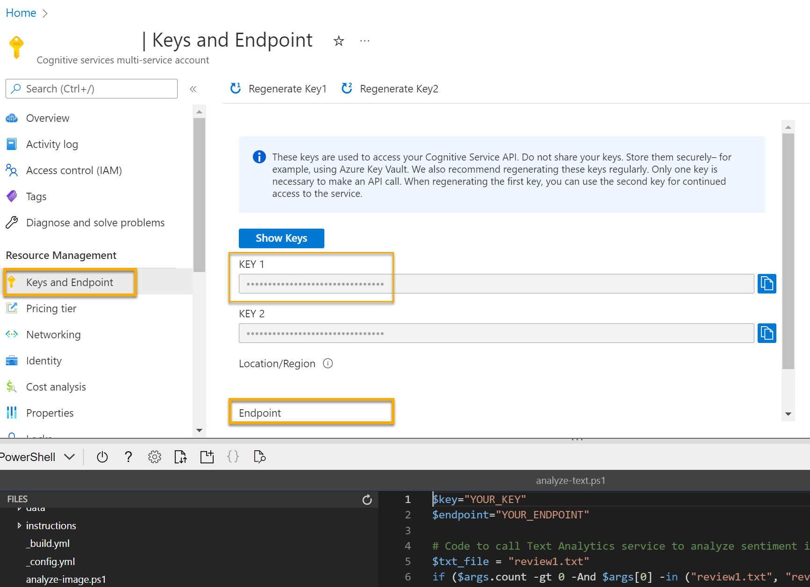

---
lab:
  title: Explorar a análise de texto
---

# Explorar a análise de texto

> **Observação** Para concluir este laboratório, você precisará de uma [assinatura do Azure](https://azure.microsoft.com/free?azure-portal=true) na qual tenha acesso administrativo.

O NLP (Processamento de Linguagem Natural) é um branch de IA (inteligência artificial) que lida com linguagem escrita e falada. Você pode usar o NLP para criar soluções que extraem o significado semântico de um texto ou uma fala ou que formulam respostas significativas em linguagem natural.

Os *serviços de IA do Microsoft Azure* incluem as funcionalidades de análise de texto no serviço de *Linguagem*, que fornece alguns recursos de NLP prontos para uso, incluindo a identificação de frases-chave no texto e a classificação de texto com base no sentimento.

Por exemplo, suponha que a organização fictícia *Margie's Travel* incentive os clientes a enviarem avaliações para o hotel. Você pode usar o serviço de linguagem para resumir as avaliações por meio da extração de frases-chave e depois determinar quais são positivas e quais são negativas ou analisar o texto da avaliação em busca de menções de entidades conhecidas, como locais ou pessoas.

Para testar os recursos do serviço de linguagem, usaremos um aplicativo de linha de comando simples executado no Cloud Shell. Os mesmos princípios e funcionalidades se aplicam em soluções do mundo real, como sites ou aplicativos de telefone.

## Criar um recurso dos *serviços de IA do Azure*

O serviço de linguagem pode ser usado por meio da criação de um recurso de **Linguagem** ou de um recurso dos **serviços de IA do Azure**.

Caso ainda não tenha feito isso, crie um recurso dos **serviços de IA do Azure** em sua assinatura do Azure.

1. Em outra guia do navegador, abra o portal do Azure em [https://portal.azure.com](https://portal.azure.com?azure-portal=true) e entre com sua conta Microsoft.

1. Clique no botão **&#65291;Criar um recurso** e pesquise por *serviços de IA do Azure*. Selecione **criar** um plano dos **serviços de IA do Azure**. Você será levado para uma página para criar um recurso dos serviços de IA do Azure. Defina-o com as seguintes configurações:
    - **Assinatura**: *sua assinatura do Azure*.
    - **Grupo de recursos**: *selecione ou crie um grupo de recursos com um nome exclusivo*.
    - **Região**: *escolha uma região disponível*.
    - **Nome**: *insira um nome exclusivo*.
    - **Tipo de preço**: Standard S0
    - **Ao marcar esta caixa, confirmo que li e compreendi todos os termos abaixo**: selecionada.

1. Revise e crie o recurso.

### Obtenha a chave e o ponto de extremidade para o seu recurso dos serviços de IA do Azure

1. Aguarde o fim da implantação. Em seguida, acesse o recurso dos serviços de IA do Azure e, na página de **Visão geral**, selecione o link para gerenciar as chaves do serviço. Você precisará do ponto de extremidade e das chaves para se conectar ao recurso de serviços de IA do Azure de aplicativos cliente.

1. Exiba a página **Chaves e Ponto de Extremidade** do seu recurso. Você precisará da **chave** e do **ponto de extremidade** para se conectar em aplicativos clientes.

## Executar o Cloud Shell

Para testar as funcionalidades de análise de texto do serviço de linguagem, vamos usar um aplicativo de linha de comando simples que é executado no Cloud Shell no Azure.

1. No portal do Azure, selecione o botão **[>_]** (*Cloud Shell*) na parte superior da página à direita da caixa de pesquisa. Isso abre um painel do Cloud Shell na parte inferior do Portal.

    

1. Na primeira vez que você abrir o Cloud Shell, talvez precise escolher o tipo de shell que deseja usar (*Bash* ou *PowerShell).* Selecione **PowerShell**. Se não vir essa opção, ignore a etapa.  

1. Se precisar criar o armazenamento para o Cloud Shell, verifique se sua assinatura está especificada e selecione **Criar armazenamento**. Aguarde um minuto para a criação do armazenamento.

    

1. Verifique se o tipo de shell indicado na parte superior esquerda do painel do Cloud Shell indica *PowerShell*. Se for *Bash*, alterne para o *PowerShell* usando o menu suspenso.

    

1. Aguarde o início do PowerShell. Você deverá ver a seguinte tela no portal do Azure:  

    

## Configurar e executar um aplicativo cliente

Agora que você tem um modelo personalizado, pode executar um aplicativo cliente simples que usa o serviço de linguagem.

1. No shell de comando, digite o comando a seguir para baixar o aplicativo de exemplo e salvá-lo em uma pasta chamada ai-900.

    ```PowerShell
    git clone https://github.com/MicrosoftLearning/AI-900-AIFundamentals ai-900
    ```

    >**Dica** Se você já usou esse comando em outro laboratório para clonar o repositório *ai-900*, ignore esta etapa.

1. Os arquivos são baixados em uma pasta chamada **ai-900**. Agora queremos ver todos os arquivos em seu armazenamento do Cloud Shell e trabalhar com eles. Digite o seguinte comando no shell:

     ```PowerShell
    code .
    ```

    Observe como isso abre um editor como o da imagem abaixo:

    

1. No painel **Arquivos** à esquerda, expanda **ai-900** e selecione **analyze-text.ps1**. Esse arquivo contém um código que usa o serviço de linguagem:

    

1. Não se preocupe muito com os detalhes do código. No portal do Azure, navegue até o recurso dos serviços de IA do Azure. Em seguida, selecione a página **Chaves e Pontos de Extremidade** no painel esquerdo. Copie a chave e o ponto de extremidade da página e cole-os no editor de código, substituindo os valores de espaço reservado **YOUR_KEY** e **YOUR_ENDPOINT**, respectivamente.

    > **Dica** Talvez seja necessário usar a barra separadora para ajustar a área da tela durante o trabalho com os painéis **Chaves e ponto de extremidade** e **Editor**.

    

    Depois de substituir os valores de chave e ponto de extremidade, as primeiras linhas de código devem ser semelhantes a esta:

    ```PowerShell
    $key="1a2b3c4d5e6f7g8h9i0j...."
    $endpoint="https..."
    ```

1. No canto superior direito do painel do editor, use o botão **…** para abrir o menu e selecione **Salvar** para salvar as alterações. Em seguida, abra o menu novamente e selecione **Fechar Editor**.

    O aplicativo cliente de exemplo usará o serviço de linguagem dos serviços de IA do Azure para detectar o idioma, extrair frases-chave, determinar o sentimento e extrair entidades conhecidas de avaliações.

1. No Cloud Shell, insira o seguinte comando para executar o código:

    ```PowerShell
    cd ai-900
    ./analyze-text.ps1 review1.txt
    ```

    Você revisará este texto:

    >Bom hotel e boa equipe Royal Hotel, Londres, Reino Unido 02/03/2018 Quartos limpos, bom atendimento, ótima localização, perto do Palácio de Buckingham e da Westminster Abbey e assim por diante. Nós adoramos toda a nossa estada. O pátio é muito tranquilo e fomos a um restaurante indiano que faz parte do mesmo grupo (da costa oeste, portanto, com muito peixe) com uma estrela Michelin. Comemos o menu degustação, que estava fabuloso. Os cômodos eram muito bem equipados, com cozinha, sala, quarto e um banheiro enorme. Altamente recomendado.

1. Examine a saída.

1. No painel do PowerShell, insira o seguinte comando para executar o código:

    ```PowerShell
    ./analyze-text.ps1 review2.txt
    ```

    Você revisará este texto:

    >Hotel desgastado com serviço ruim Royal Hotel, Londres, Reino Unido 06/05/2018 Trata-se de um hotel antigo (existe desde 1950), com uma mobília dos quartos mediana, que está ficando um pouco velha e precisa ser trocada. A Internet não funcionou, e eu precisei ir até um dos escritórios do hotel para fazer o check-in do meu voo de regresso. O site diz que ele fica perto do British Museum, mas é muito longe para ir caminhando.

1. Examine a saída.

1. No painel do PowerShell, insira o seguinte comando para executar o código:

    ```PowerShell
    ./analyze-text.ps1 review3.txt
    ```

    Você revisará este texto:

    >Boa localização e equipe prestativa, mas em uma estrada movimentada.
    Lombard Hotel, São Francisco, EUA 16/08/2018 Ficamos aqui em agosto, depois de ler as avaliações. Ficamos muito satisfeitos com a localização, logo atrás da Rua Chestnut, uma área cosmopolita e badalada com muitas opções de restaurantes. Adoramos passear pelo distrito de Marina, que tem casas muito interessantes. Não deixe de ir até o Museu de Belas Artes de São Francisco e até Marina para ter uma boa vista da ponte Golden Gate e da cidade. Fica em uma rota de ônibus, e é fácil de ir até o centro. Os quartos estavam limpos e eram bem espaçosos, e a equipe era cordial e prestativa. O único ponto negativo foi o barulho da Rua Lombard, então, peça para ficar em um quarto mais afastado do barulho do trânsito.

1. Examine a saída.

1. No painel do PowerShell, insira o seguinte comando para executar o código:

    ```PowerShell
    ./analyze-text.ps1 review4.txt
    ```

    Você revisará este texto:

    >Muito barulhento e com quartos minúsculos Lombard Hotel, São Francisco, EUA 05/09/2018 O hotel fica localizado na Rua Lombard, que é uma estrada de SEIS pistas muito movimentada, bem na saída da Ponte Golden Gate. Tem trânsito desde o início da manhã até o fim da noite, especialmente nos finais de semana. O barulho não seria tão ruim se os quartos fossem mais isolados, mas não eram. Tive que colocar algodão nos ouvidos para conseguir dormir e fiquei cansado demais para aproveitar a cidade no dia seguinte. Os quartos são MINÚSCULOS. Eu escolhi o quarto porque tinha duas camas queen, mas elas mal cabiam ali. Com uma família de quatro pessoas no quarto, ficou bem apertado. Dito isso, os quartos são limpos, e notamos um empenho em remodelá-los. O hotel fica no distrito de Marina, com vários bons lugares para comer e a uma curta caminhada até o Presidio. Pode ser um bom hotel para jovens adultos que ficam acordados até tarde e que têm um orçamento limitado.

1. Examine a saída.

## Saiba mais

Esse aplicativo simples mostra apenas alguns dos recursos do serviço de linguagem. Saiba mais sobre o que você pode fazer com esse serviço conferindo a [página do serviço de linguagem](https://azure.microsoft.com/services/cognitive-services/language-service/).

