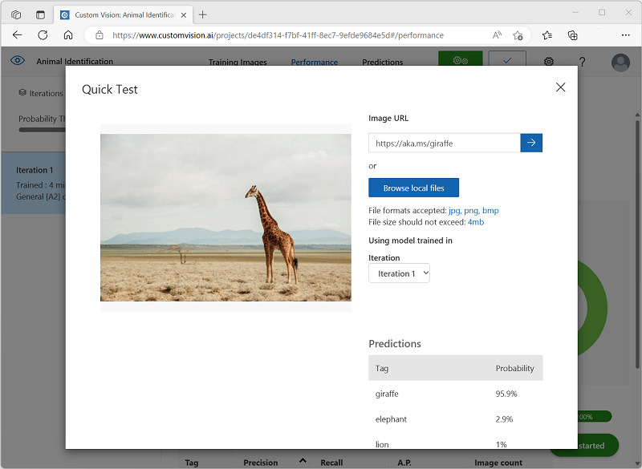

---
lab:
  title: Explorar a classificação de imagem
---

# Explorar a classificação de imagem

O serviço da *Visão de IA do Azure* fornece modelos predefinidos úteis para trabalhar com imagens, mas você frequentemente precisará treinar seu próprio modelo para pesquisa visual computacional. Por exemplo, suponha que uma organização de conservação da vida selvagem queira rastrear avistamentos de animais usando câmeras sensíveis ao movimento. As imagens capturadas pelas câmeras poderiam então ser usadas para verificar a presença de determinadas espécies em uma determinada área e ajudar nos esforços de conservação para espécies ameaçadas de extinção. Para fazer isso, a organização se beneficiaria de um modelo de *classificação de imagem* treinado para identificar diferentes espécies de animais nas fotografias capturadas.

No Azure, você pode usar o serviço ***Visão Personalizada*** para treinar um modelo de classificação de imagem com base em imagens existentes. A criação de uma solução de classificação de imagem envolve dois elementos. Primeiro, você deve treinar um modelo para reconhecer classes diferentes usando imagens existentes. Depois, após o treinamento do modelo, você deverá publicá-lo como um serviço que pode ser consumido por aplicativos.

Para testar os recursos do serviço de Visão Personalizada, usaremos um aplicativo de linha de comando simples que é executado no Cloud Shell. Os mesmos princípios e funcionalidades se aplicam a soluções do mundo real, como sites ou aplicativos móveis.

## Antes de começar

Para concluir este laboratório, será necessário uma [assinatura do Azure](https://azure.microsoft.com/free?azure-portal=true) na qual você tenha acesso administrativo.

## Criar um recurso dos *serviços de IA do Azure*

Você pode utilizar o serviço Visão Personalizada criando um recurso de **Visão Personalizada** ou um recurso de **Serviços de IA do Azure**.

>**Observação** Nem todos recursos estão disponíveis em todas as regiões. Se você criar um recurso de Visão Personalizada ou de serviços de IA do Azure, somente os recursos criados em [certas regiões](https://azure.microsoft.com/global-infrastructure/services/?products=cognitive-services) poderão ser utilizados para acessar os serviços de Visão Personalizada. Para simplificar, uma região é pré-selecionada para você nas instruções de configuração abaixo.

Crie um recurso de **serviços de IA do Azure** na sua assinatura do Azure.

1. Abra o portal do Azure em [https://portal.azure.com](https://portal.azure.com?azure-portal=true), entrando com a sua conta Microsoft.

1. Clique no botão **&#65291;Criar um recurso** e pesquise por *serviços de IA do Azure*. Selecione **criar** um plano dos **serviços de IA do Azure**. Você será levado para uma página para criar um recurso dos serviços de IA do Azure. Defina-o com as seguintes configurações:
    - **Assinatura**: *sua assinatura do Azure*.
    - **Grupo de recursos**: *selecione ou crie um grupo de recursos com um nome exclusivo*.
    - **Região:** Leste dos EUA
    - **Nome**: *insira um nome exclusivo*.
    - **Tipo de preço**: Standard S0
    - **Ao marcar esta caixa, confirmo que li e compreendi todos os termos abaixo**: selecionada.

1. Examine e crie o recurso e aguarde a conclusão da implantação. Em seguida, vá para o recurso implantado.

1. Exiba a página **Chaves e Ponto de Extremidade** do recurso dos serviços de IA do Azure. Você precisará do ponto de extremidade e das chaves para se conectar em aplicativos cliente.

## Criar um projeto de Visão Personalizada

Para treinar um modelo de detecção de objetos, você precisa criar um projeto de Visão Personalizada com base em seu recurso de treinamento. Para fazer isso, você usará o portal de Visão Personalizada.

1. Baixe e extraia as imagens de treinamento do [https://aka.ms/animal-images](https://aka.ms/animal-images). Essas imagens são fornecidas em uma pasta compactada que, quando extraída, contém subpastas chamadas **elefante**, **girafa** e **leão**.

1. Abra uma nova guia do navegador e navegue até o portal de Visão Personalizada em [https://customvision.ai](https://customvision.ai?azure-portal=true). Caso solicitado, entre usando a conta Microsoft associada à sua assinatura do Azure e concorde com os termos de serviço.

1. No portal de Visão Personalizada, crie um projeto com as seguintes configurações:

    - **Nome**: identificação animal
    - **Descrição**: classificação de imagem de animais
    - **Recurso**: *o recurso de serviços de IA do Azure ou de Visão Personalizada criado anteriormente*
    - **Tipos de Projeto**: Classificação
    - **Tipos de classificação**: multiclasse (tag única por imagem)
    - **Domínios**: Geral \[A2]

1. Clique em **Adicionar imagens** e selecione todos os arquivos da pasta **elefante** que você já havia extraído. Em seguida, carregue os arquivos de imagem, especificando a marca *elefante*, desta forma:

    

1. Use o botão **Adicionar imagens** ([+]) para carregar as imagens na pasta **girafa** com a marca *girafa* e as imagens na pasta **leão** com a marca *leão*.

1. Explore as imagens que você carregou no projeto de Visão Personalizada – deve haver 17 imagens de cada classe, desta forma:

    

1. No projeto de Visão Personalizada, acima das imagens, clique em **Treinar** para treinar um modelo de classificação usando as imagens com tag. Selecione a opção **Treinamento Rápido** e aguarde a conclusão da iteração de treinamento.

    > **Dica**: o treinamento pode demorar alguns minutos. Enquanto você está esperando, confira [Como selfies de leopardo-da-neve e IA podem ajudar a salvar a espécie da extinção](https://news.microsoft.com/transform/snow-leopard-selfies-ai-save-species/), que descreve um projeto real que usa a pesquisa visual computacional para rastrear animais em extinção na natureza.

1. Quando a iteração do modelo tiver sido treinada, revise as métricas de desempenho de *Precisão*, *Recall* e *PA* – elas medem a precisão de predição do modelo de classificação e devem ser todas altas.

## Testar o modelo

Antes de publicar essa iteração do modelo para uso dos aplicativos, você deve testá-la.

1. Acima das métricas de desempenho, clique em **Início Rápido**.

1. Na caixa **URL da Imagem**, digite `https://aka.ms/giraffe` e clique no botão **imagem de teste rápido (&#10132;)** .

1. Exiba as previsões retornadas por seu modelo – a pontuação de probabilidade para *girafa* deve ser a mais alta, assim:

    

1. Feche a janela **Teste Rápido**.

## Publicar o modelo de classificação de imagem

Agora está tudo pronto para publicar seu modelo treinado e usá-lo em um aplicativo cliente.

1. Clique em **&#128504; Publicar** para publicar o modelo treinado com as seguintes configurações:
    - **Nome do modelo**: animais
    - **Recurso de Previsão**: *o recurso de previsão de serviços de IA do Azure ou de Visão Personalizada criado anteriormente*.

1. Após a publicação, clique no ícone *URL de Previsão* (&#127760;) para ver as informações necessárias para usar o modelo publicado.

    

Posteriormente, você precisará da URL e dos valores de Prediction-Key apropriados para obter uma previsão de uma URL de imagem. Portanto, mantenha essa caixa de diálogo aberta e vá para a próxima tarefa.

## Preparar um aplicativo cliente

Para testar os recursos do serviço de Visão Personalizada, usaremos um aplicativo de linha de comando simples que é executado no Cloud Shell no Azure.

1. Volte para a guia do navegador que contém o portal do Azure e selecione o botão **Cloud Shell** ( **[>_]** ) na parte superior da página à direita da caixa de pesquisa. Isso abre um painel do Cloud Shell na parte inferior do portal.

    Na primeira vez que você abrir o Cloud Shell, talvez precise escolher o tipo de shell que deseja usar (*Bash* ou *PowerShell).* Nesse caso, selecione **PowerShell**.

    Se você precisar criar o armazenamento para o Cloud Shell, verifique se sua assinatura está selecionada e selecione **Criar armazenamento**. Aguarde um minuto para a criação do armazenamento.

    Quando o Cloud Shell estiver pronto, ele deverá ser semelhante a isto:
    
    

    > **Dica**: verifique se o tipo de shell indicado na parte superior esquerda do painel do Cloud Shell é *PowerShell*. Se for *Bash*, alterne para o *PowerShell* usando o menu suspenso.

    Observe que você pode redimensionar o Cloud Shell arrastando a barra do separador na parte superior do painel ou usando os ícones **&#8212;** , **&#9723;** e **X** no canto superior direito do painel para minimizar, maximizar e fechar o painel. Para obter mais informações de como usar o Azure Cloud Shell, confira a [documentação do Azure Cloud Shell](https://docs.microsoft.com/azure/cloud-shell/overview).

2. No shell de comando, insira os comandos a seguir para baixar os arquivos deste exercício e salvá-los em uma pasta chamada **ai-900** (depois de remover essa pasta, se ela já existir)

    ```PowerShell
    rm -r ai-900 -f
    git clone https://github.com/MicrosoftLearning/AI-900-AIFundamentals ai-900
    ```

3. Depois que os arquivos forem baixados, insira os seguintes comandos para alterar para o diretório **ai-900** e edite o arquivo de código para este exercício:

    ```PowerShell
    cd ai-900
    code classify-image.ps1
    ```

    Observe como isso abre um editor igual ao da imagem abaixo:

     

     > **Dica**: você pode usar a barra separadora entre a linha de comando do Cloud Shell e o editor de código para redimensionar os painéis.

4. Não se preocupe muito com os detalhes do código. O importante é que ele começa com algum código para especificar a URL de previsão e a chave para seu modelo de Visão Personalizada. Você precisará atualizá-los para que o restante do código use seu modelo.

    Obtenha a *URL de previsão* e a *chave de previsão* da caixa de diálogo que você deixou aberta na guia do navegador do projeto Visão Personalizada. **Você precisará que as versões sejam usadas *se tiver uma URL de imagem*.**

    Use esses valores para substituir os espaços reservados **YOUR_PREDICTION_URL** e **YOUR_PREDICTION_KEY** no arquivo de código.

    Depois de colar os valores de URL de Previsão e Chave de Previsão, as duas primeiras linhas de código devem ser semelhantes a esta:

    ```PowerShell
    $predictionUrl="https..."
    $predictionKey ="1a2b3c4d5e6f7g8h9i0j...."
    ```

5. Depois de fazer as alterações nas variáveis no código, pressione **CTRL+S** para salvar o arquivo. Em seguida, pressione **CTRL+Q** para fechar o editor de códigos.

## Testar o aplicativo cliente

Agora você pode usar o aplicativo cliente de exemplo para classificar imagens com base no animal que elas contêm.

1. No painel do PowerShell, insira o seguinte comando para executar o código:

    ```PowerShell
    ./classify-image.ps1 1
    ```

    Esse código usa seu modelo para classificar a seguinte imagem:

    

1. Examine a previsão, que deve ser **girafa**.

1. Vamos experimentar agora com outra imagem. Execute este comando:

    ```PowerShell
    ./classify-image.ps1 2
    ```

    Desta vez, a seguinte imagem é classificada:

    

1. Verifique se o modelo classifica essa imagem como **elefante**.

1. Vamos tentar mais uma. Execute este comando:

    ```PowerShell
    ./classify-image.ps1 3
    ```

    A imagem final tem esta aparência:

    

1. Verifique se o modelo classifica essa imagem como **leão**.

Espero que seu modelo de classificação de imagem classificou corretamente todas as três imagens.


