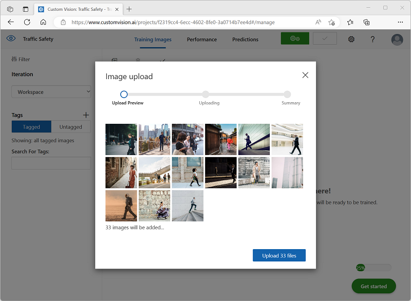

---
lab:
  title: Explorar a detecção de objetos
---

# Explorar a detecção de objetos

> **Observação** Para concluir este laboratório, você precisará de uma [assinatura do Azure](https://azure.microsoft.com/free?azure-portal=true) na qual tenha acesso administrativo.

*A detecção de objetos* é uma forma de pesquisa visual computacional na qual um modelo de machine learning é treinado para classificar instâncias individuais de objetos em uma imagem e indicar uma *caixa delimitadora* que marca o local. Você pode pensar nisso como uma progressão da *classificação de imagem* (na qual o modelo responde à pergunta "de que se trata essa imagem?") para criar soluções em que podemos perguntar ao modelo "quais objetos estão nessa imagem e onde eles estão?".

Por exemplo, uma iniciativa de segurança viária pode identificar pedestres e ciclistas como sendo os usuários mais vulneráveis nos cruzamentos de trânsito. Usando câmeras para monitorar cruzamentos, imagens de usuários nas ruas podem ser analisadas para detectar pedestres e ciclistas a fim de monitorar seus números ou até mesmo alterar o comportamento dos sinais de trânsito.

O serviço **Visão Personalizada** no Microsoft Azure fornece uma solução baseada em nuvem para a criação e publicação de modelos personalizados de detecção de objetos. No Azure, você pode usar o serviço Visão Personalizada para treinar um modelo de detecção de objetos com base em imagens existentes. A criação de uma solução de detecção de objetos envolve dois elementos. Primeiro, você deve treinar um modelo para detectar a localização e a classe de objetos usando imagens rotuladas. Depois, após o treinamento do modelo, você deverá publicá-lo como um serviço que pode ser consumido por aplicativos.

Para testar os recursos do serviço de Visão Personalizada a fim de detectar objetos em imagens, usaremos um aplicativo de linha de comando simples que é executado no Cloud Shell. Os mesmos princípios e funcionalidades se aplicam a soluções do mundo real, como sites ou aplicativos móveis.

## Criar um recurso dos *serviços de IA do Azure*

Você pode utilizar o serviço Visão Personalizada criando um recurso de **Visão Personalizada** ou um recurso de **Serviços de IA do Azure**.

> **Observação** Nem todos recursos estão disponíveis em todas as regiões. Se você criar um recurso de Visão Personalizada ou de serviços de IA do Azure, somente os recursos criados em [certas regiões](https://azure.microsoft.com/global-infrastructure/services/?products=cognitive-services) poderão ser utilizados para acessar os serviços de Visão Personalizada. Para simplificar, uma região é pré-selecionada para você nas instruções de configuração abaixo.

Crie um recurso de **serviços de IA do Azure** na sua assinatura do Azure.

1. Em outra guia do navegador, abra o portal do Azure em [https://portal.azure.com](https://portal.azure.com?azure-portal=true) e entre com sua conta Microsoft.

1. Clique no botão **&#65291;Criar um recurso** e pesquise por *serviços de IA do Azure*. Selecione **criar** um plano dos **serviços de IA do Azure**. Você será levado para uma página para criar um recurso dos serviços de IA do Azure. Defina-o com as seguintes configurações:
    - **Assinatura**: *sua assinatura do Azure*.
    - **Grupo de recursos**: *selecione ou crie um grupo de recursos com um nome exclusivo*.
    - **Região:** Leste dos EUA
    - **Nome**: *insira um nome exclusivo*.
    - **Tipo de preço**: Standard S0
    - **Ao marcar esta caixa, confirmo que li e compreendi todos os termos abaixo**: selecionada.

1. Examine e crie o recurso e aguarde a conclusão da implantação. Em seguida, vá para o recurso implantado.

1. Exiba a página **Chaves e Ponto de Extremidade** do recurso dos serviços de IA do Azure. Você precisará do ponto de extremidade e das chaves para se conectar em aplicativos cliente.

## Criar um projeto de Visão Personalizada

Para treinar um modelo de detecção de objetos, você precisa criar um projeto de Visão Personalizada com base em seu recurso de treinamento. Para fazer isso, você usará o portal de Visão Personalizada.

1. Em uma nova guia do navegador, abra o portal de Visão Personalizada em [https://customvision.ai](https://customvision.ai?azure-portal=true) e entre usando a conta Microsoft associada à sua assinatura do Azure.

1. Crie um novo projeto com as seguintes configurações:
    - **Nome**: Segurança de Trânsito
    - **Descrição**: detecção de objetos para segurança viária.
    - **Recurso**: *o recurso criado anteriormente*
    - **Tipos de projeto**: detecção de objetos
    - **Domínios**: Geral \[A1]

1. Aguarde a criação e abertura do projeto no navegador.

## Adicionar e marcar imagens

Para treinar um modelo de detecção de objeto, você precisa carregar imagens que contenham as classes que serão identificadas pelo modelo e marcá-las para indicar caixas delimitadoras para cada instância de objeto.

1. Baixe e extraia as imagens de treinamento do [https://aka.ms/traffic-images](https://aka.ms/traffic-images). A pasta extraída contém uma coleção de imagens de ciclistas e pedestres.

1. No portal de Visão Personalizada, no seu projeto de detecção de objetos **Segurança de Trânsito**, selecione **Adicionar imagens** e faça upload de todas as imagens da pasta extraída.

    

1. Depois de carregar as imagens, selecione a primeira para abri-la.

1. Mantenha o mouse sobre qualquer objeto (ciclista ou pedestre) na imagem até que uma região detectada automaticamente seja exibida. Em seguida, selecione o objeto e, se necessário, reorganize a região para cercá-lo. Como alternativa, você pode simplesmente arrastar o objeto para criar uma região.

    Quando o objeto estiver fortemente selecionado na região retangular, insira a marca apropriada para o objeto (*Ciclista* ou *Pedestre*) e use o botão **Marcar região** ( **+** ) para adicionar a marca ao projeto.

    

1. Use o link **Avançar** ( **(>)** à direita para ir para a próxima imagem e marcar os objetos. Em seguida, continue trabalhando em toda a coleção de imagens, marcando cada ciclista e pedestre.

    Ao marcar as imagens, observe o seguinte:

    - Algumas imagens contêm vários objetos, potencialmente de tipos diferentes. Marque cada uma delas, mesmo que elas se sobreponham.
    - Depois que uma marca for inserida uma vez, você poderá selecioná-la na lista ao marcar novos objetos.
    - Você pode navegar pelas imagens para ajustar as marcas.

    

1. Quando terminar de marcar a última imagem, feche o editor **Detalhes da Imagem** e, na página **Imagens de Treinamento**, em **Marcações**, selecione **Marcado** para ver todas as suas imagens marcadas:

    

## Treinar e testar um modelo

Agora que você marcou as imagens em seu projeto, está tudo pronto para treinar um modelo.

1. No projeto Visão Personalizada, clique em **Treinar** para treinar um modelo de detecção de objeto usando as imagens marcadas. Selecione a opção **Treinamento Rápido**.

    > **Dica**: o treinamento pode demorar alguns minutos. Enquanto você está esperando, marcar [análise de vídeo para cidades inteligentes](https://www.microsoft.com/research/video/video-analytics-for-smart-cities/), que descreve um projeto real para usar a pesquisa visual computacional em uma iniciativa de aprimoramento de segurança viária.

2. Quando o treinamento estiver concluído, examine as métricas de desempenho de *Precisão*, *Recall* e *mAP*. Essas métricas medem a utilidade da previsão do modelo de detecção de objetos e devem ser razoavelmente altas.

3. Ajuste o **Limite de Probabilidade** à esquerda, aumentando-o de 50% para 90% e observe o efeito nas métricas de desempenho. Essa configuração determina o valor de probabilidade que cada avaliação de marca deve atender ou exceder para ser contada como uma previsão.

    

4. No canto superior direito da página, clique em **Teste Rápido** e, na caixa **URL da Imagem**, insira `https://aka.ms/pedestrian-cyclist` e veja os resultados.

    No painel à direita, em **Previsões**, cada objeto detectado é listado com sua marca e probabilidade. Selecione cada objeto para vê-lo realçado na imagem.

    Os objetos previstos podem não estar todos corretos. Afinal, ciclistas e pedestres compartilham muitas características comuns. As previsões sobre as quais o modelo está mais confiante têm os valores de probabilidade mais altos. Use o controle deslizante **Valor Limite** para eliminar objetos com uma probabilidade baixa. Você deve ser capaz de encontrar um ponto no qual apenas as previsões corretas estão incluídas (provavelmente em torno de 85 a 90%).

    

5. Em seguida, feche a janela **Teste Rápido**.

## Publicar o modelo de detecção de objeto

Agora está tudo pronto para publicar seu modelo treinado e usá-lo em um aplicativo cliente.

1. Clique em **&#128504; Publicar** para publicar o modelo treinado com as seguintes configurações:
    - **Nome do módulo**: traffic-safety
    - **Recurso de previsão**: *o recurso que você já havia criado*.

1. Após a publicação, clique no ícone *URL de Previsão* (&#127760;) para ver as informações necessárias para usar o modelo publicado.

    

Posteriormente, você precisará da URL e dos valores de Prediction-Key apropriados para obter uma previsão de uma URL de imagem. Portanto, mantenha essa caixa de diálogo aberta e vá para a próxima tarefa.

## Preparar um aplicativo cliente

Para testar os recursos do serviço de Visão Personalizada, usaremos um aplicativo de linha de comando simples que é executado no Cloud Shell no Azure.

1. Volte para a guia do navegador que contém o portal do Azure e selecione o botão **Cloud Shell** ( **[>_]** ) na parte superior da página à direita da caixa de pesquisa. Isso abre um painel do Cloud Shell na parte inferior do portal.

    Na primeira vez que você abrir o Cloud Shell, talvez precise escolher o tipo de shell que deseja usar (*Bash* ou *PowerShell).* Nesse caso, selecione **PowerShell**.

    Se você precisar criar o armazenamento para o Cloud Shell, verifique se sua assinatura está selecionada e selecione **Criar armazenamento**. Aguarde um minuto para a criação do armazenamento.

    Quando o Cloud Shell estiver pronto, ele deverá ser semelhante a isto:
    
    

    > **Dica**: verifique se o tipo de shell indicado na parte superior esquerda do painel do Cloud Shell é *PowerShell*. Se for *Bash*, alterne para o *PowerShell* usando o menu suspenso.

    Observe que você pode redimensionar o Cloud Shell arrastando a barra do separador na parte superior do painel ou usando os ícones **&#8212;** , **&#9723;** e **X** no canto superior direito do painel para minimizar, maximizar e fechar o painel. Para obter mais informações de como usar o Azure Cloud Shell, confira a [documentação do Azure Cloud Shell](https://docs.microsoft.com/azure/cloud-shell/overview).

2. No shell de comando, insira os comandos a seguir para baixar os arquivos deste exercício e salvá-los em uma pasta chamada **ai-900** (depois de remover essa pasta, se ela já existir)

    ```PowerShell
    rm -r ai-900 -f
    git clone https://github.com/MicrosoftLearning/AI-900-AIFundamentals ai-900
    ```

3. Depois que os arquivos forem baixados, insira os seguintes comandos para alterar para o diretório **ai-900** e edite o arquivo de código para este exercício:

    ```PowerShell
    cd ai-900
    code detect-objects.ps1
    ```

    Observe como isso abre um editor igual ao da imagem abaixo:

     

     > **Dica**: você pode usar a barra separadora entre a linha de comando do Cloud Shell e o editor de código para redimensionar os painéis.

4. Não se preocupe muito com os detalhes do código. O importante é que ele começa com algum código para especificar a URL de previsão e a chave para seu modelo de Visão Personalizada. Você precisará atualizá-los para que o restante do código use seu modelo.

    Obtenha a *URL de previsão* e a *chave de previsão* da caixa de diálogo que você deixou aberta na guia do navegador do projeto Visão Personalizada. Você precisará que as versões sejam usadas *se tiver uma URL de imagem*.

    Use esses valores para substituir os espaços reservados **YOUR_PREDICTION_URL** e **YOUR_PREDICTION_KEY** no arquivo de código.

    Depois de colar os valores de URL de Previsão e Chave de Previsão, as duas primeiras linhas de código devem ser semelhantes a esta:

    ```PowerShell
    $predictionUrl="https..."
    $predictionKey ="1a2b3c4d5e6f7g8h9i0j...."
    ```

5. Depois de fazer as alterações nas variáveis no código, pressione **CTRL+S** para salvar o arquivo. Em seguida, pressione **CTRL+Q** para fechar o editor de códigos.

## Testar o aplicativo cliente

Agora você pode usar o aplicativo cliente de exemplo para detectar ciclistas e pedestres em imagens.

1. No painel do PowerShell, insira o seguinte comando para executar o código:

    ```PowerShell
    ./detect-objects.ps1 1
    ```

    Esse código usa seu modelo para detectar objetos na seguinte imagem:

    

1. Examine a previsão, que lista todos os objetos detectados com uma probabilidade de 90% ou mais, juntamente com as coordenadas de uma caixa delimitadora em torno de sua localização.

1. Vamos experimentar agora com outra imagem. Execute este comando:

    ```PowerShell
    ./detect-objects.ps1 2
    ```

    Desta vez, a seguinte imagem é analisada:

    

Com corte, seu modelo de detecção de objetos fez um bom trabalho detectando pedestres e ciclistas nas imagens de teste.

