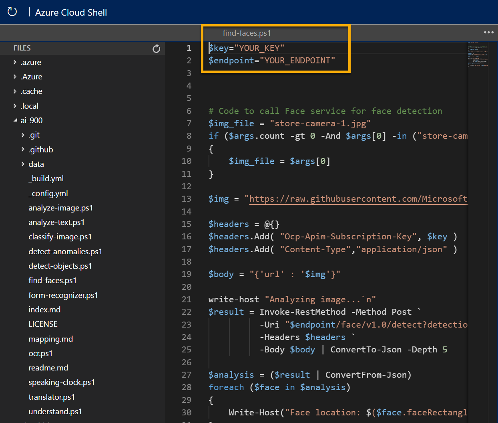

---
lab:
  title: Explorar o reconhecimento facial
---

# <a name="explore-face-recognition"></a>Explorar o reconhecimento facial

> **Observação** Para concluir este laboratório, você precisará de uma [assinatura do Azure](https://azure.microsoft.com/free?azure-portal=true) na qual tenha acesso administrativo.

As soluções de pesquisa visual computacional costumam exigir uma solução de IA (inteligência artificial) para detecção de rostos humanos. Por exemplo, suponha que a empresa de varejo Northwind Traders queira localizar onde os clientes estão em uma loja para melhor ajudá-los. Uma maneira de fazer isso é determinar se há rostos nas imagens e, se for o caso, identificar as coordenadas da caixa delimitadora ao redor dos rostos.

Para testar os recursos do serviço de Detecção Facial, usaremos um aplicativo de linha de comando simples executado no Cloud Shell. Os mesmos princípios e funcionalidades se aplicam a soluções do mundo real, como sites ou aplicativos de telefone.

## <a name="create-a-cognitive-services-resource"></a>Criar um recurso dos *Serviços Cognitivos*

O serviço de Detecção Facial pode ser usado por meio da criação de um recurso de **Detecção Facial** ou dos **Serviços Cognitivos**.

Caso ainda não tenha feito isso, crie um recurso dos **Serviços Cognitivos** em sua assinatura do Azure.

1. Em outra guia do navegador, abra o portal do Azure em [https://portal.azure.com](https://portal.azure.com?azure-portal=true) e entre com sua conta Microsoft.

1. Clique no botão **&#65291;Criar um recurso**, pesquise *Serviços Cognitivos* e crie um recurso dos **Serviços Cognitivos** com as seguintes configurações:
    - **Assinatura**: *sua assinatura do Azure*.
    - **Grupo de recursos**: *selecione ou crie um grupo de recursos com um nome exclusivo*.
    - **Região**: *escolha uma região disponível*.
    - **Nome**: *insira um nome exclusivo*.
    - **Tipo de preço**: Standard S0
    - **Ao marcar esta caixa, confirmo que li e compreendi todos os termos abaixo**: selecionada.

1. Examine e crie o recurso e aguarde a conclusão da implantação. Em seguida, vá para o recurso implantado.

1. Exiba a página **Chaves e Ponto de Extremidade** do recurso dos Serviços Cognitivos. Você precisará do ponto de extremidade e das chaves para se conectar em aplicativos cliente.

## <a name="run-cloud-shell"></a>Executar o Cloud Shell

Para testar os recursos do serviço de Detecção Facial, usaremos um aplicativo de linha de comando simples executado no Cloud Shell no Azure. 

1. No portal do Azure, selecione o botão **[>_]** (*Cloud Shell*) na parte superior da página à direita da caixa de pesquisa. Isso abre um painel do Cloud Shell na parte inferior do Portal. 

    

1. Na primeira vez que você abrir o Cloud Shell, talvez precise escolher o tipo de shell que deseja usar (*Bash* ou *PowerShell).* Selecione **PowerShell**. Se não vir essa opção, ignore a etapa.  

1. Se precisar criar o armazenamento para o Cloud Shell, verifique se sua assinatura está especificada e selecione **Criar armazenamento**. Aguarde um minuto para a criação do armazenamento.

           

1. Verifique se o tipo de shell indicado na parte superior esquerda do painel do Cloud Shell indica *PowerShell*. Se for *Bash*, alterne para o *PowerShell* usando o menu suspenso.

     

1. Aguarde o início do PowerShell. Você deverá ver a seguinte tela no portal do Azure:  

    

## <a name="configure-and-run-a-client-application"></a>Configurar e executar um aplicativo cliente

Agora que você tem um modelo personalizado, pode executar um aplicativo cliente simples que usa o serviço de Detecção Facial.

1. No shell de comando, digite o comando a seguir para baixar o aplicativo de exemplo e salvá-lo em uma pasta chamada ai-900.

    ```PowerShell
    git clone https://github.com/MicrosoftLearning/AI-900-AIFundamentals ai-900
    ```

    > **Dica** Se você já usou esse comando em outro laboratório para clonar o repositório *ai-900*, ignore esta etapa.

1. Os arquivos são baixados em uma pasta chamada **ai-900**. Agora queremos ver todos os arquivos em seu armazenamento do Cloud Shell e trabalhar com eles. Digite o seguinte comando no shell:

     ```PowerShell
    code .
    ```

    Observe como isso abre um editor como o da imagem abaixo: 

     

1. No painel **Arquivos** à esquerda, expanda **ai-900** e selecione **find-faces.ps1**. Esse arquivo contém um código que usa o serviço de Detecção Facial para detectar e analisar rostos em uma imagem, como mostrado aqui:

    

1. Não se preocupe muito com os detalhes do código, o importante é que ele precisa da URL do ponto de extremidade e de uma das chaves do seu recurso dos Serviços Cognitivos. Copie-os da página **Chaves e Pontos de Extremidade** do seu recurso do portal do Azure e os copie no editor de códigos, substituindo os valores de espaço reservado **YOUR_KEY** e **YOUR_ENDPOINT**, respectivamente.

    > **Dica** Talvez seja necessário usar a barra separadora para ajustar a área da tela durante o trabalho com os painéis **Chaves e ponto de extremidade** e **Editor**.

    Depois de colar os valores de chave e ponto de extremidade, as duas primeiras linhas de código devem ser semelhantes a esta:

    ```PowerShell
    $key="1a2b3c4d5e6f7g8h9i0j...."    
    $endpoint="https..."
    ```

1. No canto superior direito do painel do editor, use o botão **...** para abrir o menu e selecione **Salvar** para salvar as alterações. Em seguida, abra o menu novamente e selecione **Fechar Editor**.

    O aplicativo cliente de exemplo usará seu serviço de Detecção Facial para analisar a imagem abaixo, feita por uma câmera na loja Northwind Traders:

    

1. No painel do PowerShell, insira os seguintes comandos para executar o código:

    ```PowerShell
    cd ai-900
    ./find-faces.ps1 store-camera-1.jpg
    ```

1. Examine as informações retornadas, que incluem o local do rosto na imagem. O local do rosto é indicado pelas coordenadas no lado superior esquerdo e pela largura e altura de uma *caixa delimitadora*, conforme mostrado aqui:

    

    >**Observação** As funcionalidades de serviço de detecção facial que retornam características pessoais identificáveis são restritas. Para obter detalhes, consulte https://azure.microsoft.com/blog/responsible-ai-investments-and-safeguards-for-facial-recognition/.

1. Vamos experimentar agora com outra imagem:

    

    Para analisar a segunda imagem, digite o seguinte comando:

    ```PowerShell
    ./find-faces.ps1 store-camera-2.jpg
    ```

1. Examine os resultados da análise de rosto da segunda imagem.

1. Vamos tentar mais uma:

    

    Para analisar a terceira imagem, digite o seguinte comando:

    ```PowerShell
    ./find-faces.ps1 store-camera-3.jpg
    ```

1. Examine os resultados da análise do rosto da terceira imagem.

## <a name="learn-more"></a>Saiba mais

Esse aplicativo simples mostra apenas alguns dos recursos do serviço de Detecção Facial. Para saber o que você pode fazer com esse serviço, confira a [página da API de Detecção Facial](https://azure.microsoft.com/services/cognitive-services/face/).
