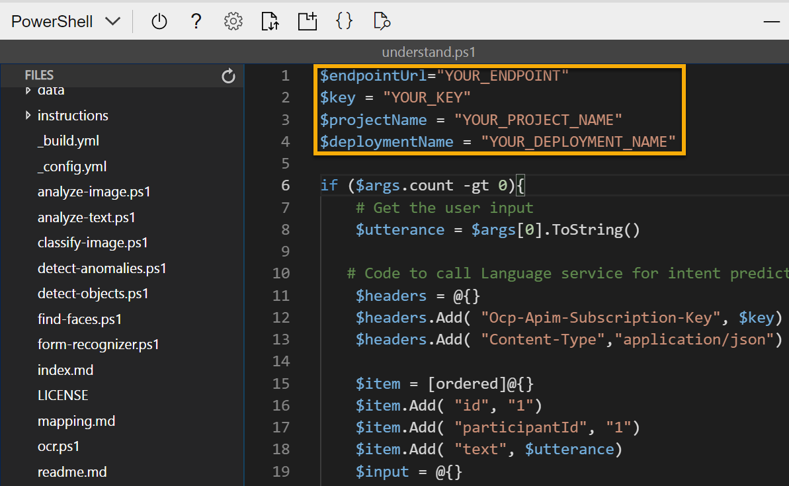

---
lab:
  title: Explorar o reconhecimento de linguagem
---

# Explorar o reconhecimento de linguagem

> **Observação** Para concluir este laboratório, você precisará de uma [assinatura do Azure](https://azure.microsoft.com/free?azure-portal=true) na qual tenha acesso administrativo.

Cada vez mais, esperamos que os computadores sejam capazes de usar a IA para entender comandos falados ou digitados em linguagem natural. Por exemplo, talvez você queira implementar um sistema de automação residencial que permita controlar dispositivos em sua casa usando comandos de voz, por exemplo, "acender a luz" ou "ligar o ventilador", e ter um dispositivo com tecnologia de IA que entenda o comando e execute a ação apropriada.

Para testar as funcionalidades do serviço de Compreensão da Linguagem Coloquial, usaremos um aplicativo de linha de comando que é executado no Cloud Shell. Os mesmos princípios e funcionalidades se aplicam em soluções do mundo real, como sites ou aplicativos de telefone.

## Criar um recurso de *Serviço de linguagem*

Você pode usar o serviço de Compreensão da Linguagem Coloquial criando um recurso de **Serviço de linguagem**.

Caso ainda não tenha feito isso, crie um recurso de **Serviço de linguagem** em sua assinatura do Azure.

1. Em outra guia do navegador, abra o portal do Azure em [https://portal.azure.com](https://portal.azure.com?azure-portal=true) e entre com sua conta Microsoft.

1. Clique no botão **&#65291;Criar um recurso**, procure por *Serviço de linguagem* e crie um recurso de **Serviço de linguagem** com as seguintes configurações:
    - Selecionar recursos adicionais: *mantenha os recursos padrão e clique em Continuar para criar seu recurso*  
    - **Assinatura**: *sua assinatura do Azure*.
    - **Grupo de recursos**: *selecione ou crie um grupo de recursos com um nome exclusivo*.
    - **Região**: Leste dos EUA 2
    - **Nome**: *insira um nome exclusivo*.
    - **Tipo de preço**: S (mil chamadas por minuto)
    - **Ao marcar esta caixa, declaro que analisei e confirmo os termos do Aviso de IA responsável.** : selecionada.

1. Examine e crie o recurso e aguarde a conclusão da implantação.

### Criar um aplicativo de Compreensão da Linguagem Coloquial

Para implementar o reconhecimento de linguagem natural com a compreensão da linguagem coloquial, crie um aplicativo e, depois, adicione entidades, intenções e enunciados para definir os comandos que você deseja executar no aplicativo.

1. Em uma nova guia do navegador, abra o portal do Language Studio em [https://language.azure.com](https://language.azure.com?azure-portal=true) e entre usando a conta Microsoft associada à sua assinatura do Azure.

1. Se for solicitado a escolher um recurso de idioma, selecione as seguintes configurações:
    - **Azure Directory**: o diretório do Azure que contém a assinatura.
    - **Assinatura do Azure**: sua assinatura do Azure.
    - **Recurso de idioma**: o recurso de idioma criado anteriormente.

    >**Dica** Se a escolha de um recurso de linguagem ***não*** foi solicitada, talvez já haja vários recursos de linguagem na assinatura. Nesse caso:
    >1. Na barra na parte superior da página, clique no botão **Configurações (&#9881;)**.
    >1. Na página **Configurações**, exiba a guia **Recursos**.
    >1. Selecione o recurso de linguagem e clique em **Alternar recurso**.
    >1. Na parte superior da página, clique em **Language Studio** para retornar à home page do Language Studio.

1. Na parte superior do portal do Language Studio, no menu **Criar**, selecione **Compreensão da linguagem coloquial**.

1. Na caixa de diálogo **Criar um projeto**, na página **Inserir informações básicas**, insira os seguintes detalhes e clique em **Avançar**:
    - **Nome**: *crie um nome exclusivo*
    - **Descrição**: automação residencial simples
    - **Idioma primário dos enunciados**: inglês
    - **Habilitar vários idiomas no projeto**: *não selecionar*

    

    >**Dica** Anote o *nome do projeto*, pois você o usará mais tarde.

1. Na página *Examinar e concluir*, clique em **Criar**.

### Criar intenções, enunciados e entidades

Uma *intenção* é uma ação que você deseja executar, por exemplo, talvez você queira acender uma luz ou desligar um ventilador. Nesse caso, você definirá duas intenções: uma para ligar um dispositivo e outra para desligar um dispositivo. Para cada intenção, você especificará exemplos de *enunciados* que indicam o tipo de linguagem usado para indicar a intenção.

1. No painel **Definição de esquema**, verifique se a opção **Intenções** está selecionada, clique em **Adicionar**, adicione uma intenção com o nome **switch_on** (em minúsculas) e clique em **Adicionar intenção**.

    
    

1. Selecione a intenção **switch_on**. Isso levará você para a página **Rotulagem de dados**. Na lista suspensa **Intenção**, selecione **switch_on**. Ao lado da intenção **switch_on**, digite o enunciado ***turn the light on*** e pressione **Enter** para enviá-lo à lista.

    

1. O serviço de linguagem precisa de pelo menos cinco exemplos de enunciado diferentes para cada intenção para treinar suficientemente o modelo de linguagem. Adicione mais cinco exemplos de enunciado à intenção **switch_on**:  
    - ***switch on the fan***
    - ***ligar o ventilador***
    - ***ligar a luz***
    - ***ligar as luzes***
    - ***ativar o ventilador***

1. No painel **Rotulagem de entidades para treinamento** no lado direito da tela, selecione **Rótulos** e **Adicionar entidade**. Digite **device** (em minúsculas) e selecione **Listar** e **Adicionar entidade**.

     
    

1. No enunciado ***turn the fan on***, realce a palavra "fan". Em seguida, na lista exibida, na caixa *Pesquisar por uma entidade*, selecione **dispositivo**.

    

1. Faça o mesmo em todos os enunciados. Rotule o restante dos enunciados *fan* ou *light* com a entidade **device**. Quando terminar, verifique se você tem os seguintes enunciados e selecione **Salvar alterações**:

    | **intenção** | **enunciado** | **entidade** |
    | --------------- | ------------------ | ------------------ |
    | switch_on   | Ligar o ventilador      | Dispositivo – *selecionar ventilador* |
    | switch_on   | Acender as luzes    | Dispositivo – *selecionar luzes* |
    | switch_on   | Ligar as luzes | Dispositivo – *selecionar luzes* |
    | switch_on   | Ative o ventilador     | Dispositivo – *selecionar ventilador* |
    | switch_on   | Ligar o ventilador   | Dispositivo – *selecionar ventilador* |
    | switch_on   | Ative a luz   | Dispositivo – *selecionar luzes* |

     

1. No painel à esquerda, clique em **Definição de esquema** e verifique se a intenção **switch_on** está listada. Em seguida, clique em **Adicionar** e adicione uma nova intenção com o nome **desligar** (em minúsculas).

     

1. Clique na intenção **desligar**. Isso levará você para a página **Rotulagem de dados**. Na lista suspensa **Intenção**, selecione **switch_off**. Ao lado da intenção **switch_off**, adicione o enunciado ***turn the light off***.

1. Adicione mais cinco exemplos de enunciado à intenção **switch_off**.
    - ***switch off the fan***
    - ***desligar o ventilador***
    - ***apagar as luzes***
    - ***desativar as luzes***
    - ***desligar o ventilador***

1. Rotule as palavras *light* ou *fan* com a entidade **device**. Quando terminar, verifique se você tem os seguintes enunciados e selecione **Salvar alterações**:  

    | **intenção** | **enunciado** | **entidade** | 
    | --------------- | ------------------ | ------------------ |
    | switch_off   | Desligar o ventilador    | Dispositivo – *selecionar ventilador* | 
    | switch_off   | Apague as luzes  | Dispositivo – *selecionar luzes* |
    | switch_off   | Desativar as luzes | Dispositivo – *selecionar luzes* |
    | switch_off   | Desligue o ventilador | Dispositivo – *selecionar ventilador* |
    | switch_off   | Desligar o ventilador | Dispositivo – *selecionar ventilador* |
    | switch_off   | Apague as luzes | Dispositivo – *selecionar luzes* |

### Treinar o modelo

Agora está tudo pronto para usar as intenções e entidades definidas para treinar o modelo de linguagem coloquial de seu aplicativo.

1. No lado esquerdo do Language Studio, selecione **Trabalhos de treinamento** e **Iniciar um trabalho de treinamento**. Use as configurações a seguir: 
    - **Treinar um novo modelo**: *selecionado e escolha um nome do modelo*
    - **Modo de treinamento**: treinamento padrão (gratuito)
    - **Divisão de dados**: *selecione Dividir automaticamente o conjunto de testes com base nos dados de treinamento, manter os percentuais padrão*
    - Clique em **Treinar** na parte inferior da página.

1. Aguarde a conclusão do treinamento. 

### Implantar e testar o modelo

Para usar seu modelo treinado em um aplicativo cliente, você precisa implantá-lo como um ponto de extremidade para o qual os aplicativos cliente podem enviar novos enunciados, a partir dos quais as intenções e entidades serão previstas.

1. No lado esquerdo do Language Studio, clique em **Implantando um modelo**.

1. Selecione o nome do modelo e clique em **Adicionar implantação**. Use estas configurações:
    - **Criar ou selecionar um nome de implantação existente**: *selecione Criar um nome de implantação. Adicione um nome exclusivo*.
    - **Atribuir um modelo treinado ao nome da implantação**: *selecione o nome do modelo treinado*.
    - Clique em **Implantar**

    >**Dica** Anote o *nome da implantação*, pois você o usará mais tarde. 

1. Quando o modelo for implantado, clique em **Testando as implantações** no lado esquerdo da página e escolha o modelo implantado em **Nome da implantação**.

1. Insira o seguinte texto e selecione **Executar o teste**:

    *acender a luz*

     

    Revise o resultado retornado, indicando que ele inclui a intenção prevista (que deve ser **switch_on**) e a entidade prevista (**dispositivo**) com pontuações de confiança que indicam a probabilidade calculada pelo modelo para a intenção e a entidade previstas. A guia JSON mostra um comparativo de confiança para cada intenção potencial (aquela com a pontuação de confiança mais alta é a intenção prevista)

1. Limpe a caixa de texto e teste o modelo com os seguintes enunciados em *Insira o texto ou carregue um documento de texto*:
    - *desligar o ventilador*
    - *ligar a luz*
    - *desligar o ventilador*

## Executar o Cloud Shell

Agora, vamos experimentar o modelo implantado. Para fazer isso, vamos usar um aplicativo de linha de comando que é executado no Azure Cloud Shell. 

1. Deixando a guia do navegador com o Language Studio aberta, volte para a guia do navegador que contém a portal do Azure.

1. No portal do Azure, selecione o botão **[>_]** (*Cloud Shell*) na parte superior da página à direita da caixa de pesquisa. Ao clicar no botão, um painel do Cloud Shell se abre na parte inferior do portal.

    

1. Na primeira vez que você abrir o Cloud Shell, talvez precise escolher o tipo de shell que deseja usar (*Bash* ou *PowerShell).* Selecione **PowerShell**. Se não vir essa opção, ignore a etapa.  

1. Se precisar criar o armazenamento para o Cloud Shell, verifique se sua assinatura está especificada e selecione **Criar armazenamento**. Aguarde um minuto para a criação do armazenamento. 

    

1. Verifique se o tipo de shell indicado na parte superior esquerda do painel do Cloud Shell indica *PowerShell*. Se for *Bash*, alterne para o *PowerShell* usando o menu suspenso.

     

1. Aguarde o início do PowerShell. Você deverá ver a seguinte tela no portal do Azure:  

     

## Configurar e executar um aplicativo cliente

Agora, vamos abrir e editar um script pré-escrito que executará o aplicativo cliente.

1. No shell de comando, digite o comando a seguir para baixar o aplicativo de exemplo e salvá-lo em uma pasta chamada ai-900.

    ```PowerShell
    git clone https://github.com/MicrosoftLearning/AI-900-AIFundamentals ai-900
    ```

    >**Observação** Se você já usou esse comando em outro laboratório para clonar o repositório *ai-900*, ignore esta etapa.

1. Os arquivos são baixados em uma pasta chamada **ai-900**. Neste momento, queremos ver todos os arquivos nesta pasta e trabalhar com eles. Digite os seguintes comandos no shell:

     ```PowerShell
    cd ai-900
    code .
    ```

    Observe como o script abre um editor igual ao da imagem abaixo: 

    

1. No painel **Arquivos** à esquerda, selecione o arquivo **understand.ps1** na pasta **ai-900**. Esse arquivo contém um código que usa seu modelo de Compreensão da Linguagem Coloquial. 

    

    Não se preocupe muito com os detalhes do código. O importante é que você usará as instruções abaixo para modificar o arquivo a fim de especificar o modelo de linguagem treinado. 

1. Alterne novamente para a guia do navegador que contém o **Language Studio**. Depois, no Language Studio, abra a página **Implantando um modelo** e selecione seu modelo. Em seguida, clique no botão **Obter URL de previsão**. As duas informações necessárias estão nesta caixa de diálogo:
    - O ponto de extremidade para seu modelo – você pode copiar o ponto de extremidade da caixa **URL de Previsão**.
    - A chave para seu modelo – a chave está na **solicitação de exemplo** como o valor para o parâmetro **Ocp-Apim-Subscription-Key** e é semelhante a ***0ab1c23de4f56gh7i8901234jkl567m8***.

1. Copie o valor do ponto de extremidade e volte para a guia do navegador que contém o Cloud Shell e copie-o no editor de código, substituindo **YOUR_ENDPOINT** (entre aspas). Depois, repita esse processo para a chave, substituindo **YOUR_KEY**.

1. Em seguida, substitua **NOME_DO_PROJETO** pelo nome do projeto e **NOME_DA_IMPLANTAÇÃO** pelo nome do modelo implantado. As primeiras linhas de código devem ser parecidas com as vistas abaixo:

    ```PowerShell
    $endpointUrl="https://some-name.cognitiveservices.azure.com/language/..."
    $key = "0ab1c23de4f56gh7i8901234jkl567m8"
    $projectName = "name"
    $deploymentName = "name"
    ```

1. No canto superior direito do painel do editor, use o botão **...** para abrir o menu e selecione **Salvar** para salvar as alterações. Em seguida, abra o menu novamente e selecione **Fechar Editor**.

1. No painel do PowerShell, insira o seguinte comando para executar o código:

    ```PowerShell
    ./understand.ps1 "Turn on the light"
    ```

1. Revise os resultados. O aplicativo deve ter previsto que a ação pretendida é acender a luz.

1. Agora, tente outro comando:

    ```PowerShell
    ./understand.ps1 "Switch the fan off"
    ```

1. Revise os resultados desse comando. O aplicativo deve ter previsto que a ação pretendida é desligar o ventilador.

1. Experimente mais alguns comandos, incluindo comandos nos quais o modelo não foi treinado, como "Olá" ou "ligar o forno". O aplicativo geralmente entende comandos para os quais seu modelo de linguagem foi definido e falha em outras entradas.

>**Observação** Você sempre precisará começar com **./understand.ps1** seguido da frase. Inclua aspas em torno da frase.

## Saiba mais

Esse aplicativo mostra apenas algumas das funcionalidades do recurso de Compreensão da Linguagem Coloquial do Serviço de linguagem. Saiba mais sobre o que você pode fazer com esse serviço conferindo a [página Compreensão da Linguagem Coloquial](https://docs.microsoft.com/azure/cognitive-services/language-service/conversational-language-understanding/overview). 
